Prozedurale GPU-Grafik ersetzt gespeicherte Inhalte durch mathematische Regeln. Am Beispiel eines von Minecraft inspirierten Terrains zeigen wir, wie aus einem Seed über Noise-Funktionen, die Shader-Pipeline und prozedurale Texturierung in Echtzeit eine sichtbare Welt entsteht.

# Einführung {#einfuehrung}

## Was ist prozedurale Generierung? {#einfuehrung1}

Digitale Welten wirken heute oft nahezu unbegrenzt. Würde jede Oberfläche, jede Textur und jede Geländeform vollständig von Hand erstellt und als fertige Datei gespeichert, würden Speicherbedarf, Ladezeiten und Produktionsaufwand schnell unpraktikabel werden.

Ein anschauliches Beispiel dafür ist Minecraft. Die Spielwelt ist in sogenannte Chunks unterteilt. Ein Chunk umfasst in der aktuellen Java Edition $16 × 384 × 16$ Blöcke. Eine maximale, (stabil) spielbare Welt von ungefähr $30 Millionen × 30 Millionen$ Blöcken mit 384 Höhenstufen ergäbe etwa $3{,}5 \cdot 10^{17}$ mögliche Blockpositionen. Selbst bei nur 1 Byte pro Position wären das ungefähr 350 000 Terabyte, in der Realität viel viel mehr.


## Unterschied zu klassischen Texturen {#einfuehrung2}

Die zentrale Idee prozeduraler Generierung ist deshalb, nicht die gesamte Welt selbst zu speichern, sondern Regeln, Parameter und Zufallsinitialisierung. 
Aus einem Seed und mathematischen Funktionen entstehen reproduzierbare Strukturen. Dieselbe Eingabe erzeugt wieder dieselbe Landschaft, ohne dass jede einzelne Stelle der Welt vorher gespeichert werden muss.

Historisch spielt diese Idee in der Computergrafik seit den 1980er Jahren eine wichtige Rolle. Ken Perlin beschrieb 1985 mit „An Image Synthesizer“ ein Verfahren, das natürliche Strukturen wie Wolken, Feuer, Marmor oder Landschaften durch mathematisch erzeugten Noise modellieren konnte. 
Der wichtige Unterschied zu reinem Zufall ist dabei Kohärenz. Benachbarte Werte sollen nicht völlig unabhängig sein, sondern glatte Übergänge bilden. Erst dadurch entstehen Muster, die für natürliche Formen plausibel wirken.

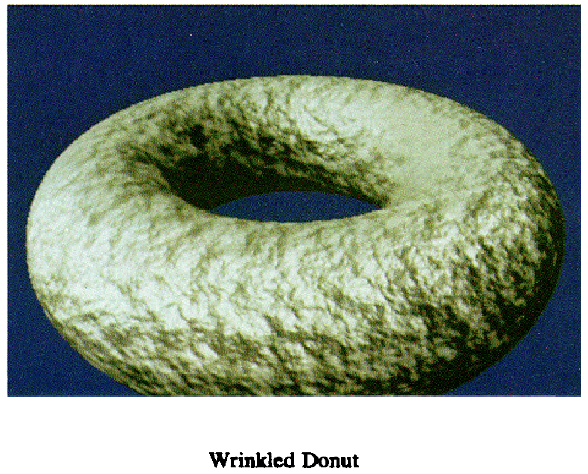{width="45%"} 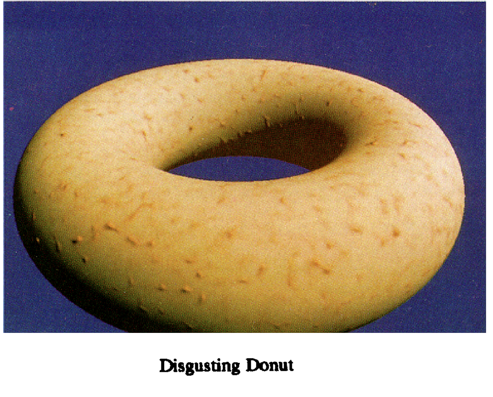{width="45%"}


## Verwandte Methoden im Vergleich {#einfuehrung3}

Prozedurale Generierung mit Shadern ist nicht die einzige Methode, um komplexe grafische Inhalte zu erzeugen. Sie steht zwischen mehreren verwandten Ansätzen, die jeweils andere Stärken und Schwächen haben. Der zentrale Unterschied liegt darin, ob Inhalte vorher gespeichert, durch Regeln erzeugt, aus Beispielen zusammengesetzt, durch Simulation berechnet oder aus Daten gelernt werden.

| Methode | Grundidee | Vorteile | Nachteile |
| --- | --- | --- | --- |
| Assetbasierte Erstellung | Inhalte werden manuell erstellt und gespeichert | Hohe gestalterische Kontrolle, gezielte Qualität | Hoher Speicherbedarf, hoher Produktionsaufwand, begrenzte Variation | 
| Noise-basierte Verfahren | Mathematische Funktionen erzeugen strukturierte Zufälligkeit | Wenig Speicher, reproduzierbar, gut parametrisierbar | Kann künstlich wirken | 
| Regelbasierte Verfahren (a)| Algorithmen erzeugen komplexe Strukturen, oft fraktal-basiert | Wie oben, sehr komplexe Formen erzeugbar | Regelentwurf aufwendig, weniger geeignet für freie Terrainformen | 
| Constraintbasierte Verfahren (b)| Bausteine werden nach Nachbarschaftsregeln zusammengesetzt | Erzeugt konsistenten Style, gut für Muster und Module | Kann Konflikte erzeugen, globale Kontrolle schwierig | 
| Simulationsbasierte Verfahren (c,d) | Physikalische Prozesse wie Erosion, Wasserfluss oder Sedimenttransport formen das Ergebnis | Hohe natürliche Plausibilität | Rechenintensiv, oft schwer in Echtzeit | 
| Datengetriebene Verfahren | Reale Daten oder gelernte Modelle erzeugen Inhalte | Sehr realistische Ergebnisse möglich | Benötigt Daten, Modelle oder große Eingaben |

<br>

::: {layout-ncol=2}

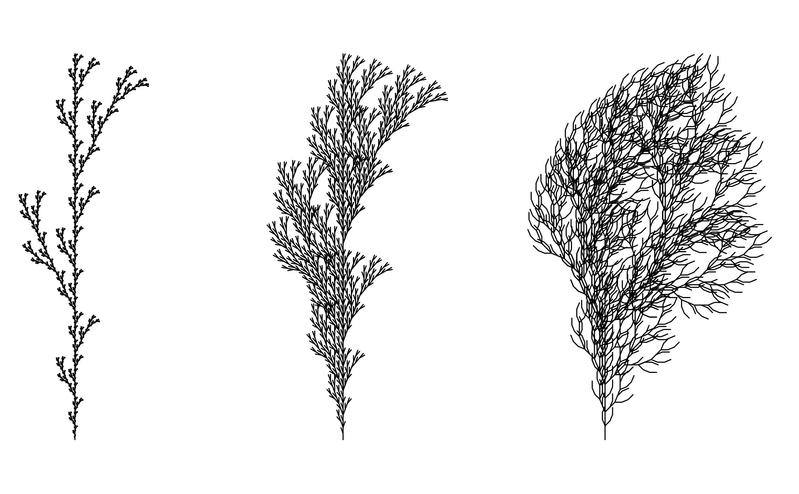{width="100%"}

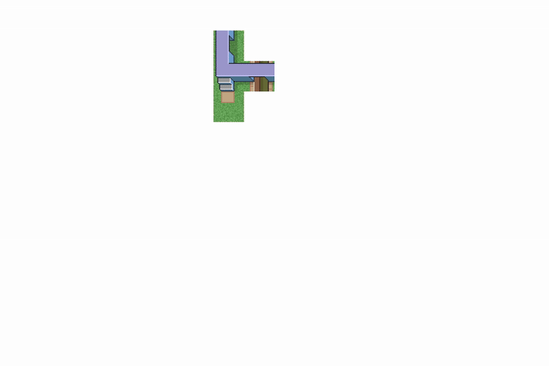{width="100%"}

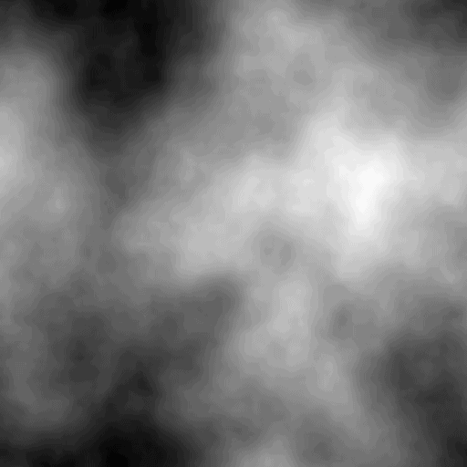{width="100%"}

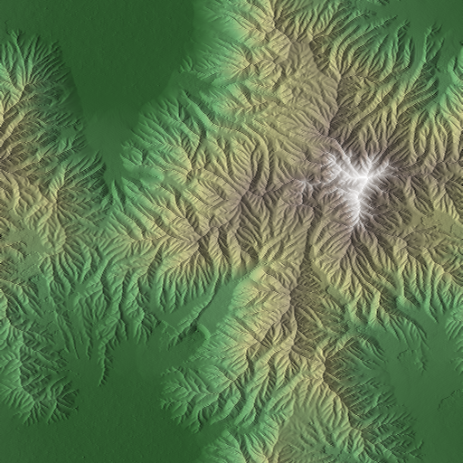{width="100%"}
:::


# Hintergrund {#hintergrund}

## Vom Seed zum gerenderten Terrain {#hintergrund1}
Am Anfang der prozeduralen Terrain-Generierungsteht noch keine Geometrie, sondern ein Seed und mehrere Parameter. Diese Eingaben werden durch eine Noise Funktion ausgewertet. Das Ergebnis ist eine Noise Map, also ein zweidimensionales Feld numerischer Werte. Eine solche Map ist noch keine Landschaft. Sie enthält weder Vertices noch Dreiecke noch Blöcke. Erst durch eine Interpretation werden aus den Zahlen Höhenwerte, Dichtewerte, Materialregeln oder Texturinformationen.
Für die Darstellung muss diese Datenrepräsentation anschließend in die Rendering Pipeline überführt werden. 

Für unsere Veranschaulichung ist wichtig, dass dieselbe Noise Map unterschiedlich interpretiert werden kann. 
Bei einer CPU Heightmap wird aus den Noise Werten zuerst ein fertiges Mesh erzeugt. Die Höhen stehen dann bereits im Vertex Buffer, bevor die GPU die Geometrie rendert. 
Bei einer Voxel Darstellung werden aus denselben Höhenwerten diskrete Block Säulen aufgebaut. 
Beim Vertex Displacement wird dagegen nur ein flaches Grid an die GPU übergeben. Die eigentliche Höhenverschiebung erfolgt erst im Vertex Shader. 
Der Fragment Shader kann anschließend die Oberfläche nach Regeln einfärben, zum Beispiel abhängig von Höhe, Steigung oder Wasserstand.

<div id="terrain-flow-demo" class="terrain-flow-demo">

<div class="flow-main-row">
<div class="flow-node flow-always-active" data-node="seed">
<strong>Seed</strong>
<span>Parameter</span>
</div>

<div class="flow-arrow">→</div>

<div class="flow-node flow-always-active" data-node="noise">
<strong>Noise Map</strong>
<span>2D Wertefeld</span>
</div>

<div class="flow-arrow">→</div>

<div class="flow-node" data-node="interpretation">
<strong>Interpretation</strong>
<span>Höhe, Blöcke oder Textur</span>
</div>

<div class="flow-arrow">→</div>


<div class="method-card-row">

<button class="method-card active" data-method="heightmap">
<strong>CPU Heightmap</strong>
<span>CPU erzeugt ein fertiges Dreiecksmesh</span>
</button>

<button class="method-card" data-method="voxel">
<strong>Voxel Säulen</strong>
<span>CPU erzeugt diskrete Blockinstanzen</span>
</button>

<button class="method-card" data-method="displacement">
<strong>Vertex Displacement</strong>
<span>GPU verformt ein flaches Grid im Vertex Shader</span>
</button>

</div>

<div class="detail-box">

<div class="detail-title" id="terrain-detail-title">
CPU Heightmap
</div>

<div class="detail-text" id="terrain-detail-text">
Die Noise Werte werden auf der CPU als Höhen interpretiert. Daraus entsteht ein fertiges Dreiecksmesh. Die Höhen stehen bereits im Vertex Buffer, bevor die GPU rendert.
</div>

<div class="mini-pipeline" id="terrain-mini-pipeline">
Noise Map → CPU erzeugt Mesh → Vertex Buffer → Vertex Shader → Fragment Shader → Framebuffer
</div>

</div>

</div>

<script>
(function () {
  const demo = document.getElementById("terrain-flow-demo")
  if (!demo) return

  const cards = demo.querySelectorAll(".method-card")
  const nodes = demo.querySelectorAll(".flow-node")
  const title = document.getElementById("terrain-detail-title")
  const text = document.getElementById("terrain-detail-text")
  const miniPipeline = document.getElementById("terrain-mini-pipeline")

  const methods = {
    heightmap: {
      title: "CPU Heightmap",
      text: "Die Noise Werte werden auf der CPU als Höhen interpretiert. Daraus entsteht ein fertiges Dreiecksmesh. Die Höhen stehen bereits im Vertex Buffer, bevor die GPU rendert.",
      pipeline: "Noise Map → CPU erzeugt Mesh → Vertex Buffer → Vertex Shader → Fragment Shader → Framebuffer",
      activeNodes: ["interpretation", "geometry", "pipeline"]
    },
    voxel: {
      title: "Voxel Säulen",
      text: "Die Noise Werte werden ebenfalls auf der CPU interpretiert. Statt eines glatten Meshes entstehen diskrete Block Säulen. Die CPU erzeugt viele Blockinstanzen, die anschließend gerendert werden.",
      pipeline: "Noise Map → CPU erzeugt Blockinstanzen → Vertex Shader → Fragment Shader → Framebuffer",
      activeNodes: ["interpretation", "geometry", "pipeline"]
    },
    displacement: {
      title: "Vertex Displacement",
      text: "Die CPU übergibt nur ein flaches Grid und eine Heightmap Textur. Die eigentliche Höhenverschiebung passiert erst im Vertex Shader auf der GPU.",
      pipeline: "Noise Map als Textur → flaches Grid → Vertex Shader verformt Vertices → Fragment Shader → Framebuffer",
      activeNodes: ["interpretation", "geometry", "pipeline"]
    }
  }

  function setMethod(methodName) {
    const method = methods[methodName]

    cards.forEach(card => {
      card.classList.toggle("active", card.dataset.method === methodName)
    })

    nodes.forEach(node => {
      if (node.classList.contains("flow-always-active")) return
      node.classList.toggle("active", method.activeNodes.includes(node.dataset.node))
    })

    title.textContent = method.title
    text.textContent = method.text
    miniPipeline.textContent = method.pipeline
  }

  cards.forEach(card => {
    card.addEventListener("click", () => {
      setMethod(card.dataset.method)
    })
  })

  setMethod("heightmap")
})()
</script>

</div>

## Parallelisierung durch Compute Shader {#hintergrund2}

Compute Shader sind aus dem General-Purpose-GPU Ansatz entstanden. Davor mussten GPU-Berechnungen außerhalb klassischer Grafikaufgaben oft indirekt über Texturen und Fragment Shader formuliert werden. 

Ab etwa 2006 wurde GPU-Computing mit CUDA allgemeiner programmierbar, 2008 folgte OpenCL als plattformübergreifender Standard. In Grafik-APIs wurden Compute Shader später direkt integriert, unter anderem mit DirectCompute in Direct3D 11 und mit OpenGL 4.3 im Jahr 2012.

Das Grundproblem, das Compute Shader lösen, ist die Ausführung vieler gleichartiger Berechnungen auf großen Datenfeldern. Statt einzelne Werte nacheinander auf der CPU zu berechnen, werden viele Shader Invocations parallel auf der GPU gestartet. 

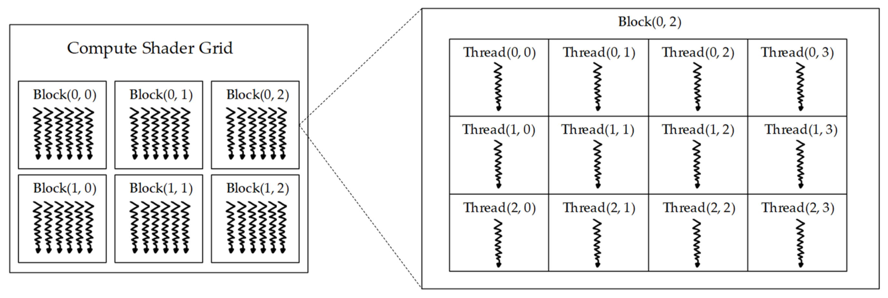

Die Grafik zeigt das Grundprinzip: Links sieht man ein Grid aus Blocks, rechts einen vergrößerten einzelnen Block mit seinen Threads. Jeder Thread führt dasselbe kleine Programm für einen anderen Datenpunkt aus. 

Für unseren Anwendungsfall könnte man das so implementieren, dass jeder Thread genau einen Wert der Noise Map berechnet. Ein Block verarbeitet also einen kleinen Ausschnitt der Map, viele Blocks zusammen könnten das vollständige Höhenfeld parallel auf der GPU erzeugen.
Diese Daten könnten anschließend ohne Rücktransfer zur CPU direkt im Vertex Shader als Heightmap genutzt und danach im Fragment Shader eingefärbt werden.

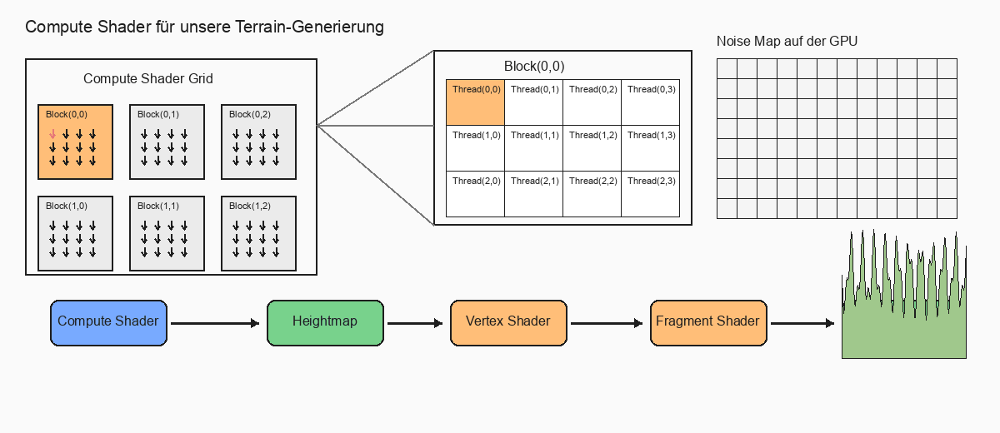

Eine Noise Map lässt sich problemlos auf der CPU berechnen, und der Aufwand für WebGPU, Speicherbindung und Synchronisation wäre in unserem Fall nicht notwendig. 
Compute Shader lohnen sich vor allem bei großen oder häufig aktualisierten Datenfeldern, etwa bei vielen Chunks, Partikeln oder Simulationen. 
Im Vergleich zu CUDA sind WebGPU-Compute Shader weniger spezialisiert und stärker auf sichere, portable Browserausführung ausgelegt, während CUDA eine reifere und hardwarenahe Plattform für Hochleistungsrechnen für NVIDIA GPUs ist.

Das gleiche Prinzip findet sich jedoch auch außerhalb der Computergrafik:

- Beim KI-Training werden große Teile neuronaler Netze als Matrixoperationen formuliert, die auf GPUs stark parallelisiert werden können.
- Bei Blockchain-Anwendungen können z.B. sehr rechenaufwändige Proof-Berechnungen über spezialisierte WebGPU-Compute Shader browserbasiert beschleunugt werden.


# Interaktive prozedurale Terrain-Generierung {#prozedural}

Dieses Kapitel zeigt anhand einer interaktiven Demo, wie prozedural eine Landschaft entsteht. 
Ausgangspunkt ist dabei keine gespeicherte Textur, sondern ein Seed, Parameter und eine mathematische Noise-Funktion. 
Aus diesen Eingaben wird zunächst ein zweidimensionales skalares Wertefeld berechnet, durch dessen anschließende Interpretation entsteht ein Terrain.

In der Computergrafik bezeichnet Noise-Generation ein Verfahren zur Erzeugung i. d. R. pseudozufälliger, aber strukturierter Werteverteilungen:

$$
n: \mathbb{R}^2 \rightarrow [0,1]
$$

Für jede Position im zweidimensionalen Raum liefert die Funktion einen normalisierten Wert.


Reiner Zufall, wie im Beispiel von White Noise, erzeugt für jeden Bildpunkt weitgehend unabhängige Werte. Für natürliche Landschaften ist das ungeeignet, weil dadurch keine zusammenhängenden, realistischen Formen entstehen.

Für Terrain-Generierung wird stattdessen kohärenter Noise benötigt, was bedeutet, dass nahe beieinanderliegende Positionen meist ähnliche Werte besitzen sollten. 
Im Folgenden werden Noise Funktionen eingeführt, die weiterhin auf pseudozufälligen Werten beruhen, diese aber so interpolieren oder kombinieren, dass räumliche Kontinuität entsteht.


## Relevante Noise-Verfahren für Terrain-Generierung {#noise}

### Value Noise {#value-noise}

Value Noise ist eines der einfachsten Verfahren und dient als Grundlage vieler komplexerer Noise Typen. 
Dabei werden zunächst diskrete Gitterpunkte mit mit pseudozufälligen Werten belegt. Für eine Position zwischen diesen Gitterpunkten wird der Wert über Interpolation aus den umgebenden Gitterwerten berechnet.

Eine vereinfachte eindimensionale Darstellung lautet:

$$
v(x) = (1 - t) \cdot a + t \cdot b
$$

Dabei sind \(a\) und \(b\) die Zufallswerte an zwei benachbarten Gitterpunkten und \(t\) ist die normierte Position zwischen ihnen.

In zwei Dimensionen erfolgt die Interpolation entsprechend zwischen vier benachbarten Gitterpunkten.

Für natürlichere Übergänge wird (t) häufig nicht direkt verwendet, sondern zuerst durch eine Glättungsfunktion transformiert, zum Beispiel durch die "Hermite curve":
$$
s(t) = t^2(3 - 2t)
$$
Damit ändern sich die Werte an den Gittergrenzen weniger abrupt. Das Ergebnis wirkt weicher und räumlich zusammenhängender als reiner Zufall. Für Terrain Generierung ist Value Noise deshalb anschaulich, aber nur begrenzt realistisch. Bei niedriger Auflösung können sichtbare Gitterstrukturen entstehen. In der Praxis wird Value Noise daher häufig als einfacher Baustein für prozedurale Texturen, Masken, Shader Effekte oder generative Kunst genutzt. Für komplexere Landschaften werden oft weiterentwickelte Verfahren wie Perlin Noise oder Kombinationen mehrerer Noise Ebenen eingesetzt.

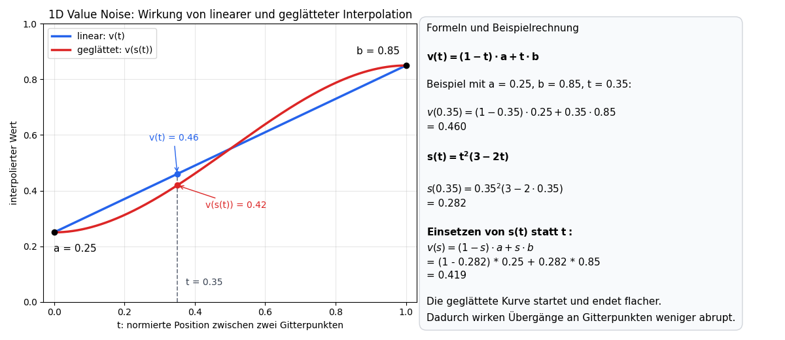

<details class="code-details">
<summary>Code-Erklärung</summary>

**Drei Schritte:**
1. Reproduzierbare Zufallswerte erzeugen
2. Werte auf einem groben Gitter speichern 
3. Für jedes Canvas-Pixel einen interpolierten Grauwert berechnen

```js
y0 = Math.floor(gy)
x1 = Math.min(x0 + 1, gridWidth - 1)
y1 = Math.min(y0 + 1, gridHeight - 1)

tx = gx - x0
ty = gy - y0

tx = fadeValue(tx)
ty = fadeValue(ty)

v00 = grid[y0][x0]
v10 = grid[y0][x1]
v01 = grid[y1][x0]
v11 = grid[y1][x1]

ix0 = lerpValue(v00, v10, tx)
ix1 = lerpValue(v01, v11, tx)

value = lerpValue(ix0, ix1, ty)
```

Die Funktion `fadeValue(t)` verwendet die Glättungsfunktion

$$
s(t) = t^2(3 - 2t)
$$

Dadurch werden die lokalen Koordinaten `tx` und `ty` vor der Interpolation geglättet. Die Übergänge zwischen benachbarten Gitterzellen wirken dadurch weicher.

Die Funktion `lerpValue(a, b, t)` berechnet eine lineare Interpolation zwischen zwei Werten:

$$
\operatorname{lerp}(a,b,t) = a(1-t) + bt
$$

In `sampleValueNoise` wird diese Interpolation in zwei Dimensionen angewendet. Zuerst werden die oberen und unteren Gitterwerte entlang der x-Richtung interpoliert. Danach werden die beiden Zwischenergebnisse entlang der y-Richtung interpoliert. Dieses Verfahren entspricht bilinearer Interpolation.

```js
function renderValueNoise(seed) {
  const cellSize = 32
  const gridWidth = Math.ceil(width / cellSize) + 1
  const gridHeight = Math.ceil(height / cellSize) + 1

  const rng = mulberry32Value(seed)
  const grid = buildValueGrid(gridWidth, gridHeight, rng)

  for (let y = 0; y < height; y++) {
    for (let x = 0; x < width; x++) {
      const value = sampleValueNoise(x, y, grid, cellSize)
      const gray = Math.floor(value * 255)
      // rgba(gray, gray, gray, 255)
    }
  }
}
```

Der Parameter `cellSize` bestimmt die räumliche Auflösung des Zufallsgitters. Größere Werte erzeugen gröbere Strukturen, kleinere Werte feinere Muster.

Die Funktion `parseValueSeed` stellt sicher, dass nur ganze numerische Seeds verwendet werden. Der Ausdruck `seed >>> 0` wandelt den Seed in eine vorzeichenlose 32-Bit-Zahl um.

</details>


<p>Gib einen numerischen Seed ein, um eine reproduzierbare Value Noise Map zu erzeugen.</p>

<div class="noise-controls-val">
  <label for="seed-input-val">Numerischer Seed:</label>
  <input id="seed-input-val" type="number" value="12345" step="1">
  <button id="generate-noise-val">Noisemap generieren</button>
</div>

<p id="noise-error-val" style="color: red;"></p>

<div class="canvas-container">
  <canvas id="noise-canvas-val" width="256" height="256"></canvas>
</div>

<p id="noise-info-val"></p>


### Perlin Noise {#perlin-noise}

Perlin Noise ist ein gradientenbasiertes Noise Verfahren und wurde von Ken Perlin als Methode zur Erzeugung natürlich wirkender prozeduraler Texturen eingeführt. 
Im Unterschied zu Value Noise werden an den Gitterpunkten keine direkten Zufallswerte gespeichert. Stattdessen erhält jeder Gitterpunkt einen pseudozufälligen Gradientenvektor.
Für einen Punkt $(p = (x,y))$ innerhalb einer Perlin-Gitterzelle wird zunächst der Abstandsvektor von jeder Zellenecke zu diesem Punkt bestimmt. 
Anschließend wird jeweils das Skalarprodukt aus Gradientenvektor und Abstandsvektor berechnet:

$$
d_{ij} = g_{ij} \cdot (p - p_{ij})
$$

Dabei ist $g_i$ der Gradientenvektor an einer Gitterecke und $p_i$ die Position dieser Gitterecke. Das Skalarprodukt beschreibt, wie stark der Abstandsvektor in Richtung des jeweiligen Gradienten zeigt.
Die vier berechneten Werte werden danach geglättet und bilinear interpoliert.

Für die Glättung wird in der Demo die von Perlin später eingeführte quintische Fade Funktion verwendet, die dafür sorgt, dass Übergänge zwischen Zellen glatter verlaufen:
$$
s(t) = 6t^5 - 15t^4 + 10t^3
$$

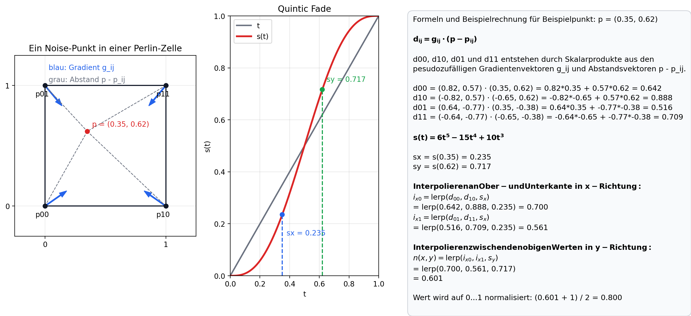

Der Parameter "Frequenz" steuert die räumliche Skalierung des Noise. Eine niedrige Frequenz erzeugt große, weiche Strukturen. 
Eine höhere Frequenz erzeugt kleinere und dichtere Muster. 

Perlin Noise allein wirkt jedoch oft noch zu gleichmäßig für realistische Terrain-Generierung. Deshalb wird er häufig mit mehreren Frequenzebenen kombiniert, zum Beispiel als Fractal Brownian Motion.


<details class="code-details">
<summary>Code-Erklärung</summary>

**Drei Schritte:**
1. Reproduzierbare Gradientenvektoren erzeugen
2. Für jedes Pixel Skalarprodukte zu den umliegenden Gitterecken berechnen 
3. Die vier Werte geglättet interpolieren und als Grauwert darstellen

```js
function randomGradient(rng) {
  const angle = rng() * Math.PI * 2
  return {
    x: Math.cos(angle),
    y: Math.sin(angle)
  }
}
```

Die Funktion randomGradient(rng) erzeugt einen zufälligen Einheitsvektor. Dafür wird ein Winkel zwischen 0 und (2\pi) erzeugt und in x und y Komponenten umgerechnet. Jeder Gitterpunkt erhält dadurch eine Richtung, aber keinen direkten Grauwert.

```js
function buildGradientGrid(gridWidth, gridHeight, rng) {
  const grid = []

  for (let y = 0; y < gridHeight; y++) {
    const row = []

    for (let x = 0; x < gridWidth; x++) {
      row.push(randomGradient(rng))
    }

    grid.push(row)
  }

  return grid
}
```

buildGradientGrid erzeugt ein zweidimensionales Array aus Gradientenvektoren. Wie bei Value Noise sorgt der Seed über mulberry32Perlin(seed) dafür, dass dasselbe Gradientenfeld reproduzierbar wieder erzeugt wird.

```js
function dotGridGradient(ix, iy, x, y, grid) {
  const gradient = grid[iy][ix]
  const dx = x - ix
  const dy = y - iy

  return dx * gradient.x + dy * gradient.y
}
```

dotGridGradient berechnet das Skalarprodukt zwischen dem Gradientenvektor an der Gitterposition (ix, iy) und dem Abstandsvektor vom Gitterpunkt zur Abtastposition (x, y).

```js
function samplePerlinNoise(x, y, grid, frequency) {
  const gx = x * frequency
  const gy = y * frequency

  const x0 = Math.floor(gx)
  const y0 = Math.floor(gy)
  const x1 = Math.min(x0 + 1, grid[0].length - 1)
  const y1 = Math.min(y0 + 1, grid.length - 1)

  const sx = fadePerlin(gx - x0)
  const sy = fadePerlin(gy - y0)

  const n00 = dotGridGradient(x0, y0, gx, gy, grid)
  const n10 = dotGridGradient(x1, y0, gx, gy, grid)
  const n01 = dotGridGradient(x0, y1, gx, gy, grid)
  const n11 = dotGridGradient(x1, y1, gx, gy, grid)

  const ix0 = lerpPerlin(n00, n10, sx)
  const ix1 = lerpPerlin(n01, n11, sx)

  return lerpPerlin(ix0, ix1, sy)
}
```

n samplePerlinNoise wird die Pixelposition zunächst durch frequency in den Noise Raum skaliert. Danach werden die vier umgebenden Gitterecken bestimmt. Für jede Ecke wird ein Skalarprodukt berechnet. Anschließend werden die Werte zuerst entlang der x Richtung und danach entlang der y Richtung interpoliert.
Die Funktion fadePerlin(t) verwendet die quintische Fade Funktion:
$$
s(t) = t^3(t(6t - 15) + 10)
$$
Das entspricht:
$$
s(t) = 6t^5 - 15t^4 + 10t^3
$$
Im Vergleich zur Hermite Kurve aus Value Noise ist diese Funktion noch glatter, weil auch die Ableitungen an den Zellgrenzen günstiger verlaufen.

```js
function renderPerlinNoise(seed, frequency) {
  const gridWidth = Math.ceil(width * frequency) + 2
  const gridHeight = Math.ceil(height * frequency) + 2
  const rng = mulberry32Perlin(seed)
  const grid = buildGradientGrid(gridWidth, gridHeight, rng)

  let minValue = Infinity
  let maxValue = -Infinity
  const values = new Array(width * height)

  for (let y = 0; y < height; y++) {
    for (let x = 0; x < width; x++) {
      const value = samplePerlinNoise(x, y, grid, frequency)
      values[y * width + x] = value
      minValue = Math.min(minValue, value)
      maxValue = Math.max(maxValue, value)
    }
  }

  const range = maxValue - minValue || 1

  for (let y = 0; y < height; y++) {
    for (let x = 0; x < width; x++) {
      const value = values[y * width + x]
      const normalized = (value - minValue) / range
      const gray = Math.floor(normalized * 255)

      // rgba(gray, gray, gray, 255)
    }
  }
}
```

renderPerlinNoise erzeugt zuerst ein Gradientenfeld, dessen Größe von Canvas Größe und Frequenz abhängt. Danach wird für jedes Pixel ein Perlin Wert berechnet. Da Perlin Noise auch negative Werte liefern kann, werden zuerst Minimum und Maximum bestimmt. Anschließend werden alle Werte auf den Bereich von 0 bis 1 normalisiert und als Graustufen dargestellt.
Die Funktion parsePerlinSeed stellt sicher, dass nur ganze numerische Seeds verwendet werden. Der Ausdruck seed >>> 0 wandelt den Seed in eine vorzeichenlose 32-Bit-Zahl um.
Die Funktion parseFrequency stellt sicher, dass die Frequenz numerisch und positiv ist. Höhere Frequenzen erhöhen die Anzahl der Gradientenwechsel im Bild und erzeugen dadurch feinere Muster.

</details>


<p>Gib einen numerischen Seed und eine Frequenz ein, um eine reproduzierbare Perlin Noise Map zu erzeugen.</p>

<div class="noise-controls-per">
  <label for="seed-input-per">Numerischer Seed:</label>
  <input id="seed-input-per" type="number" value="12345" step="1">

  <label for="frequency-input-per">Frequenz:</label>
  <input id="frequency-input-per" type="number" value="0.05" step="0.01" min="0.001">

  <button id="generate-noise-per">Noisemap generieren</button>
</div>

<p id="noise-error-per" style="color: red;"></p>

<div class="canvas-container">
  <canvas id="noise-canvas-per" width="256" height="256"></canvas>
</div>

<p id="noise-info-per"></p>


### Fractal Brownian Motion {#fbm-noise}

Eine einzelne Perlin Noise Map erzeugt glatte, zusammenhängende Strukturen. 
Für natürlich wirkende Landschaften, z.B. in der Welt von Minecraft, reicht das oft nicht aus, weil realistische Geländeformen gleichzeitig große, mittlere und kleine Strukturen brauchen. 
Fractal Brownian Motion (fBm) löst dieses Problem durch die Überlagerung mehrerer Noise Ebenen.

Diese Ebenen werden als "Octaves" bezeichnet. Jede Octave verwendet dieselbe Grundfunktion, hier Perlin Noise, aber mit anderer Frequenz und Amplitude. Niedrige Frequenzen erzeugen großflächige Formen wie Hügel oder Gebirge. 
Höhere Frequenzen erzeugen feinere Details wie Unebenheiten und Kanten.

Formal kann fBm vereinfacht so beschrieben werden:

$$
\operatorname{fBm}(x,y) =
\frac{
\sum_{i=0}^{N-1} A_i \cdot n(x \cdot f_i, y \cdot f_i)
}{
\sum_{i=0}^{N-1} A_i
}
$$

Dabei ist $n$ die zugrunde liegende Noise Funktion, $N$ die Anzahl der `Octaves` = der überlagerten Noise Ebenen. Mehr Octaves erzeugen mehr Details, erhöhen aber auch den Rechenaufwand.

$f_i$ ist die Frequenz der jeweiligen Octave und $A_i$ ihre Amplitude. In der Demo werden Frequenz und Amplitude pro Octave so berechnet:

$$
f_i = f_0 \cdot \lambda^i
$$

$$
A_i = A_0 \cdot g^i
$$

$\lambda$ bezeichnet die `Lacunarity`. Typisch ist ein Wert um `2.0`, wodurch sich die Frequenz sich von Octave zu Octave ungefähr verdoppelt.

$g$ bezeichnet den `Gain`. Typisch ist ein Wert um `0.5`. Er bestimmt, wie stark die Amplitude von Octave zu Octave abnimmt. Bei  `0.5` wird jede weitere Octave ungefähr halb so stark gewichtet.

`Frequenz` bestimmt die Grundfrequenz $f_0$ der ersten Octave. Niedrige Werte erzeugen große Formen, höhere Werte kleinere Muster. Die erste Octave erzeugt die grobe Landschaftsform. Weitere Octaves fügen kleinere Details hinzu. 

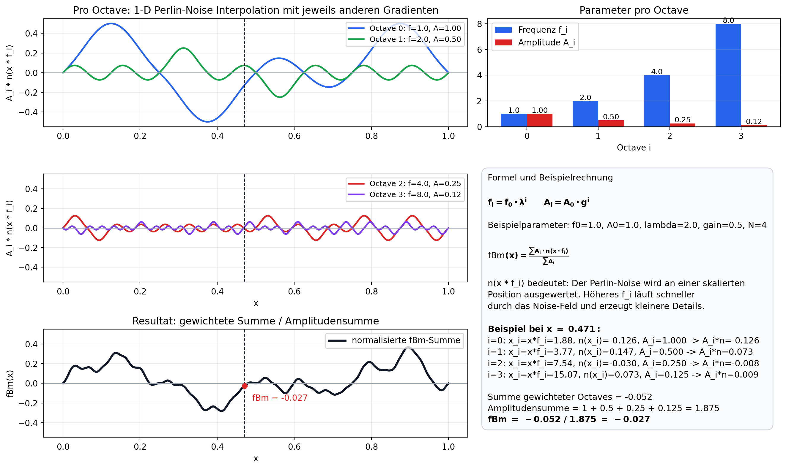


<details class="code-details">
<summary>Code-Erklärung</summary>

**Drei Schritte:**

1. Für jede Octave ein eigenes Gradientenfeld erzeugen
2. Pro Pixel mehrere Perlin-Noise-Werte mit steigender Frequenz berechnen
3. Die Octaves mit sinkender Amplitude aufsummieren und normalisieren

```js
function buildOctaveGridsFbm(seed, octaves, width, height, baseFrequency, lacunarity) {
  const octaveGrids = []

  for (let i = 0; i < octaves; i++) {
    const octaveFrequency = baseFrequency * Math.pow(lacunarity, i)
    const gridWidth = Math.ceil(width * octaveFrequency) + 2
    const gridHeight = Math.ceil(height * octaveFrequency) + 2
    const rng = mulberry32Fbm((seed + i) >>> 0)
    const grid = buildGradientGridFbm(gridWidth, gridHeight, rng)

    octaveGrids.push({
      grid,
      frequency: octaveFrequency
    })
  }

  return octaveGrids
}
```

`buildOctaveGridsFbm` erzeugt für jede Octave ein eigenes Gradientenfeld. Die Frequenz wird mit jeder Octave durch `lacunarity` skaliert. Bei einer `lacunarity` von `2.0` verdoppelt sich die Frequenz pro Octave.

Der Seed wird für jede Octave leicht verändert:

```js
const rng = mulberry32Fbm((seed + i) >>> 0)
```

Dadurch bleiben alle Ergebnisse reproduzierbar, aber die Octaves verwenden nicht exakt dasselbe Gradientenfeld.

```js
function sampleFbmNoise(x, y, octaveGrids, gain) {
  let total = 0
  let amplitude = 1
  let amplitudeSum = 0

  for (let i = 0; i < octaveGrids.length; i++) {
    const octave = octaveGrids[i]
    const value = samplePerlinNoiseFbm(x, y, octave.grid, octave.frequency)

    total += value * amplitude
    amplitudeSum += amplitude
    amplitude *= gain
  }

  if (amplitudeSum === 0) {
    return 0
  }

  return total / amplitudeSum
}
```

`sampleFbmNoise` berechnet für eine Pixelposition den fBm-Wert. Dafür wird jede Octave mit `samplePerlinNoiseFbm` ausgewertet. Der jeweilige Perlin-Wert wird mit der aktuellen Amplitude gewichtet und zu `total` addiert.

Nach jeder Octave wird die Amplitude mit `gain` multipliziert:

```js
amplitude *= gain
```

Bei einem `gain` von `0.5` trägt jede weitere Octave nur noch halb so stark zum Ergebnis bei wie die vorherige. Dadurch bleiben die großflächigen Strukturen dominant, während höhere Frequenzen vor allem feine Details hinzufügen.

Am Ende wird durch `amplitudeSum` geteilt:

```js
return total / amplitudeSum
```

Dadurch bleibt der Wertebereich stabiler, auch wenn die Anzahl der Octaves verändert wird.

```js
function renderFbmNoise(seed, frequency, octaves, lacunarity, gain) {
  const octaveGrids = buildOctaveGridsFbm(
    seed,
    octaves,
    width,
    height,
    frequency,
    lacunarity
  )

  let minValue = Infinity
  let maxValue = -Infinity
  const values = new Array(width * height)

  for (let y = 0; y < height; y++) {
    for (let x = 0; x < width; x++) {
      const value = sampleFbmNoise(x, y, octaveGrids, gain)
      values[y * width + x] = value

      minValue = Math.min(minValue, value)
      maxValue = Math.max(maxValue, value)
    }
  }

  const range = maxValue - minValue || 1

  for (let y = 0; y < height; y++) {
    for (let x = 0; x < width; x++) {
      const value = values[y * width + x]
      const normalized = (value - minValue) / range
      const gray = Math.floor(normalized * 255)

      // rgba(gray, gray, gray, 255)
    }
  }
}
```

`renderFbmNoise` erzeugt zuerst alle Octave-Grids. Danach wird für jedes Canvas-Pixel ein fBm-Wert berechnet. Da die Summe mehrerer Perlin-Werte negative und positive Werte enthalten kann, werden zuerst Minimum und Maximum bestimmt. Anschließend werden alle Werte auf den Bereich von `0` bis `1` normalisiert und als Grauwert dargestellt.

Zusätzlich speichert die Demo die erzeugte fBm-Map in `window.generatedNoiseMaps.fbm`:

```js
window.generatedNoiseMaps.fbm = {
  seed,
  frequency,
  octaves,
  lacunarity,
  gain,
  width,
  height,
  rawValues: values,
  normalizedValues,
  octaveGrids
}
```

Dadurch kann dieselbe Noise-Map später für die Terrain-Demo weiterverwendet werden.

</details>


<p>Gib Seed, Frequenz, Octaves, Lacunarity und Gain ein, um eine reproduzierbare fBm Noise Map zu erzeugen.</p>

<div class="noise-controls-fbm">
  <label for="seed-input-fbm">Numerischer Seed:</label>
  <input id="seed-input-fbm" type="number" value="12345" step="1">

  <label for="frequency-input-fbm">Frequenz:</label>
  <input id="frequency-input-fbm" type="number" value="0.02" step="0.01" min="0.001">

  <label for="octaves-input-fbm">Octaves:</label>
  <input id="octaves-input-fbm" type="number" value="4" step="1" min="1">

  <label for="lacunarity-input-fbm">Lacunarity:</label>
  <input id="lacunarity-input-fbm" type="number" value="2.0" step="0.1" min="0.1">

  <label for="gain-input-fbm">Gain:</label>
  <input id="gain-input-fbm" type="number" value="0.5" step="0.1" min="0.1">

  <button id="generate-noise-fbm">Noisemap generieren</button>
</div>

<p id="noise-error-fbm" style="color: red;"></p>

<div class="canvas-container">
  <canvas id="noise-canvas-fbm" width="256" height="256"></canvas>
</div>

<p id="noise-info-fbm"></p>


## Terrain-Generierung aus Noise Maps {#terrain}

In Abschnitt *Relevante Noise-Verfahren für Terrain-Generierung* wurde gezeigt, wie aus Zufall und Regeln eine Noise-Map erzeugt werden kann. Dieses Kapitel behandelt die nächste Stufe. Aus dem zweidimensionalen Wertefeld entsteht sichtbares Terrain.

### Einleitung

Eine **fBm-Noise-Map** ist ein diskretes _2D-Feld_ von Skalarwerten (einfachen Zahlenwerten), typischerweise wie im vorigen Kapitel, als **Grauwertbild** dargestellt. Sie enthält noch **keine Geometrie**, sondern lediglich die zugrunde liegenden **Datenwerte**. Geometrische Strukturen wie **Vertices**, **Dreiecke** oder **Blöcke**, aus denen später sichtbare Objekte oder Landschaften aufgebaut werden, entstehen erst während der **Weltgenerierung**. Erst durch die **Interpretation der Werte** entstehen Datenrepräsentationen wie **Höhenfelder**, **Dichtefelder** oder **Texturen**. Aus diesen Daten werden anschließend Geometrien erzeugt, die auf der _GPU_ visualisiert werden können.

Dabei ist in  **zwei Schritten** zu unterscheiden:

- **Weltgenerierung:** Die Noise-Map wird erstellt und ausgewertet. Daraus werden Höhen oder Dichten bestimmt und anschließend Meshes und/oder Blöcke erzeugt.
- **Rendering:** Die erzeugten Geometrien werden auf dem Bildschirm mit Hilfe der **Rendering-Pipeline** visualisiert.

Der **Schwerpunkt dieses Kapitels** liegt auf der **Weltgenerierung**. Dabei stellt sich die Frage, _wie_ die Werte einer Noise-Map in eine _konkrete_ Repräsentation der Landschaft überführt werden können.

Die folgenden Abschnitte stellen **vier verbreitete Methoden** der Terrain-Generierung aus Noise-Daten vor:

- **Heightmap-Methode:** Noise-Werte werden als Höhe $y = f(x, z)$ interpretiert und als **2D-Heightmap** auf ein **Mesh** überführt.
- **Voxel-Density:** Jedem Raumpunkt wird ein Dichtewert aus einer **3D-Noise-Funktion** zugewiesen. Aus diesen Dichtewerten wird eine **Voxel-Struktur** erzeugt.
- **Voxel-Säulen:** Ähnlich zur Heightmap-Methode wird ein **2D-Höhenfeld** verwendet, um **Voxel-Säulen** zu erzeugen.
- **Vertex-Displacement:** Die Höhe wird parallel im **Vertex-Shader** aus einer **Heightmap-Textur** berechnet.

Obwohl sich die Verfahren hinsichtlich ihrer Darstellung und technischen Implementierung unterscheiden, basieren sie auf der selben **Grundidee**. Für eine gegebene **Position** wird jeweils ein **Noise-Wert** bestimmt. Die Unterschiede entstehen erst bei dessen **Interpretation**. 

**Alle** nachfolgenden Demonstrationen greifen auf **dieselbe** mathematische Funktion zur Bestimmung der Terrainhöhe zurück. Bei **Identischen Parameter** unterscheiden sich die Ergebnisse der vorgestellten Verfahren daher nicht durch die zugrunde liegenden Daten, sondern ausschließlich in deren **Interpretation** und die daraus resultierenden **Geometrien**.


### Von der Noise-Map zur Höhe

Bevor einzelne Verfahren im Detail betrachtet werden, gilt es eine **gemeinsame Frage** zu klären:  

**Wie wird aus einem normalisierten Noise-Wert $(v)$ eine konkrete Höhe $(y)$ in Weltkoordinaten?**

Grundsätzlich existiert darauf **keine allgemeingültige Antwort**. Je nach Anwendungsfall kann eine _unterschiedliche_ Funktion, die **einen Noise-Wert** auf **eine Höhe** abbildet, als Grundlage für die Terrain-Generierung dienen. In der Praxis sollte eine Höhenfunktion jedoch _einige_ Eigenschaften erfüllen, wie zum Beispiel:

- **Stetigkeit:** Die Funktion sollte stetig verlaufen, damit **keine abrupten Übergänge** im Terrain entstehen.
- **Steuerbarkeit:** Die Parameter sollten leicht steuerbar sein, um die Form des Terrains zu modellieren.
- **Effizienz:** Die Berechnung sollte effizient ausführbar sein, um **lange Generierungszeiten** zu vermeiden.

Für die nachfolgenden Demonstrationen wird eine **gemeinsame Höhenfunktion** verwendet. Sie bildet **normalisierte Noise-Werte** auf **Weltkoordinaten** ab und stellt mehrere Parameter zur **Steuerung** der Terrain-Form bereit. Im Folgenden wird ihre konkrete Umsetzung Schritt für Schritt beschrieben.

#### Die Höhenfunktion

Ausgehend von einem normalisierten Noise-Wert $(v)$ wird die Höhenfunktion als **sigmoidale S-Kurve** aufgebaut und bildet den Wert direkt auf eine **Weltkoordinate** $H(v)$ ab. Die vollständige Funktion lautet:

$$
H(v) = H_{\mathrm{base}} + \left(H_{\mathrm{max}} - H_{\mathrm{base}}\right) \cdot \frac{v^{k}} {v^{k} + \left( \frac{1-H_{\mathrm{level}}}{H_{\mathrm{level}}} \right)(1-v)^{k}}.
$$

Zuerst wird der Rohwert auf das Intervall $[0, 1]$ **begrenzt**:

$$
v = \mathrm{clamp}(v,\, 0,\, 1)
$$

Anschließend wird der **sigmoidale Anteil** der Kurve berechnet. Er bestimmt, wie stark der Noise-Wert in Richtung der Minimal- oder Maximalhöhe übergeht:

$$
s(v) = \frac{v^{k}}{v^{k} + \left(\frac{1 - H_{\mathrm{level}}}{H_{\mathrm{level}}}\right) (1-v)^{k}}
$$

Der Parameter `Height Curve Exponent` ($k$) steuert dabei die **Stärke der S-Krümmung**. Kleinere Werte erzeugen einen **flacheren Verlauf**, größere Werte einen **steileren Übergang** mit ausgeprägteren S-Bögen.

Der Parameter `Height Level` ($H_{\mathrm{level}}$) legt den **relativen Höhenanteil bei $v=0{,}5$** fest:

$$
H(0{,}5) = H_{\mathrm{base}} + H_{\mathrm{level}}\cdot\left(H_{\mathrm{max}} - H_{\mathrm{base}}\right)
$$

Abschließend werden die **Weltkoordinaten** durch `Base Height` ($H_{\mathrm{base}}$) und `Maximum Height` ($H_{\mathrm{max}}$) festgelegt. $H_{\mathrm{base}}$ ist der Höhenwert bei $v=0$, $H_{\mathrm{max}}$ der maximal erreichbare Höhenwert bei $v=1$:

$$
H(v) = H_{\mathrm{base}} + \left(H_{\mathrm{max}} - H_{\mathrm{base}}\right)\cdot s(v)
$$

**Zusammenfassung der verwendeten Parameter:**

| Parameter             | Symbol               | Wertebereich          | Beschreibung                             |
| --------------------- | -------------------- | --------------------- | ---------------------------------------- |
| Noise Value           | $v$                  | $[0,1]$               | Normalisierter Eingabewert der Funktion  |
| Base Height           | $H_{\mathrm{base}}$  | $\ge 0$               | Höhenwert bei $v=0$                      |
| Maximum Height        | $H_{\mathrm{max}}$   | $> H_{\mathrm{base}}$ | Maximal erreichbarer Höhenwert bei $v=1$ |
| Height Curve Exponent | $k$                  | $> 0$                 | Steuert die Stärke der S-Krümmung        |
| Height Level          | $H_{\mathrm{level}}$ | $(0,1)$               | Relativer Höhenanteil bei $v=0{,}5$      |

Damit ergibt sich eine vollständige **Abbildung** vom **Noise-Wert zur finalen Höhe**. Die in den folgenden interaktiven Elementen verwendeten Regler verändern die Parameter dieser Funktion und bestimmen somit die Form der resultierenden Höhenfunktion. Die Stellgröße `Water Level` ist davon unabhängig und steuert nur die Position der Wasseroberfläche in den **Darstellungen**.

<div class="height-curve-demo" id="height-curve-demo">

<div class="height-curve-plot">
<canvas id="height-curve-canvas" width="500" height="310" aria-label="Interaktive Höhenfunktion von normalisiertem Noise-Wert zur Weltkoordinate H(v)"></canvas>
</div>

<div class="height-curve-controls">

<div class="height-curve-control">
<label for="height-curve-base">Base Height</label>
<input id="height-curve-base" type="range" min="0" max="0.9" step="0.1" value="0">
<span class="height-curve-control-value" id="height-curve-base-value">0.00</span>
</div>

<div class="height-curve-control">
<label for="height-curve-maximum">Maximum Height</label>
<input id="height-curve-maximum" type="range" min="0.1" max="1" step="0.1" value="1">
<span class="height-curve-control-value" id="height-curve-maximum-value">1.00</span>
</div>

<div class="height-curve-control">
<label for="height-curve-exponent">Height Curve Exponent</label>
<input id="height-curve-exponent" type="range" min="0.1" max="3" step="0.1" value="1.5">
<span class="height-curve-control-value" id="height-curve-exponent-value">1.5</span>
</div>

<div class="height-curve-control">
<label for="height-curve-level">Height Level</label>
<input id="height-curve-level" type="range" min="0.05" max="0.95" step="0.05" value="0.5">
<span class="height-curve-control-value" id="height-curve-level-value">0.50</span>
</div>

</div>

</div>


#### Sampling auf der CPU

Nachdem die **Höhenfunktion** definiert wurde, stellt sich eine weitere Frage:  

**Wie wird für einen Vertex oder einen Voxel der passende Noise-Wert bestimmt?**

Die Antwort hängt davon ab, wo die _Noise-Map_ **gespeichert** und **ausgewertet** wird. Der Vorgang der Bestimmung eines _Noicse-Wertes_ für eine **Position** wird als **Samping** bezeichnet und kann sowohl auf der **CPU** als auch auf der **GPU** stattfinden. Beide Ansätze verfolgen **das selbe** Ziel, können sich jedoch in der _Art und Weise_ unterscheiden, **wie** auf den vorhandenen _Noise-Daten_ **zugegriffen** wird.

Für die nachfolgenden vorgestellten **CPU-basierten Verfahren** wird eine **gemeinsame Sampling-Strategie** verwendet. Sie ordnet einer **Position** innerhalb des **Terrain-Gitters** einen **Datenpunkt** der zugrunde liegenden _fBm-Map_ zu. Im Folgenden wird diese Zuordnung Schritt für Schritt beschrieben.

Dabei liegt die _fBm-Map_ als **eindimensionales Array** mit einer Auflösung von **$W \times H$ Datenpunkten** vor. Das _Terrain-Mesh_ besitzt eine einstellbare **Gitterauflösung $R$**. Um die **Höhenfunktion** für einen _Vertex_ auswerten zu können, muss dessen **Position** zunächst einem Datenpunkt innerhalb der _fBm-Map_ zugeordnet werden. Für einen **Vertex** an der **Gitterposition $(x, z)$** werden dazu die _entsprechenden Koordinaten_ innerhalb der Noise-Map bestimmt:

$$
i_x = \left\lfloor \frac{x}{R-1} \cdot (W-1) \right\rfloor,\quad
i_z = \left\lfloor \frac{z}{R-1} \cdot (H-1) \right\rfloor
$$

Anschließend erfolgt die Umrechnung in den **linearen Array-Index**:

$$
\mathrm{index} = i_z \cdot W + i_x
$$

Der an **dieser Position** gespeicherte **Noise-Wert $v$** wird danach über die zuvor definierte Höhenfunktion in eine **Weltkoordinate $y$ überführt**.

Auf der _CPU_ erfolgt der Zugriff **diskret**, sodass immer der **nächstliegende Datenpunkt** der _fBm-Map_ verwendet wird. Eine _Interpolation_ zwischen benachbarten Werten findet hier **nicht statt**. Die Parameter `Terrain Resolution` bzw. `Voxel Resolution` steuern dabei **ausschließlich** die _Dichte des erzeugten Gitters_ und somit wie **viele Samples** für die Terrain-Generierung verwendet werden. Die Auflösung der verwendeten fBm-Map bleibt davon unberührt.

<div class="sampling-figure-center">

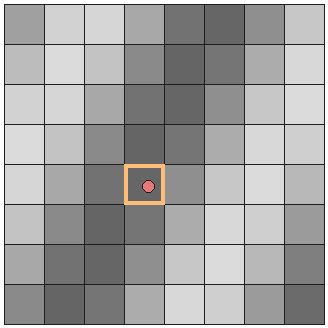

</div>

Damit ergibt sich eine **vollständige Zuordnung** von einer **Position** innerhalb des **Terrain-Gitters** zu einem **Noise-Wert** der _fBm-Map_. Die nachfolgend vorgestellten _CPU_-basierten Verfahren verwenden diese **gemeinsame Sampling-Strategie** als Grundlage zur Erzeugung ihrer jeweiligen Terrain-Repräsentation.


#### Sampling auf der GPU

Im Gegensatz zur _CPU_-basierten Auswertung werden die _fBm-Werte_ auf der **GPU** als **Graustufen-Textur** bereitgestellt und in den **Grafikspeicher** geladen. Eine **Textur** besteht dabei, wie in der Vorlesung beschrieben, aus _diskret_ gespeicherten **Texeln**, deren Werte in mehreren Komponenten (z. B. _Grau_, _RGB_ oder _RGBA_) gespeichert werden können. Im Fall der _Heightmap_ wird nur **ein einzelner Kanal** verwendet, in dem der _normalisierte Höhenwert_ ($v$) abgelegt ist.

Die **Textur** wird über ein _orthogonales_ **Koordinatensystem** beschrieben. Jedem **Vertex** eines _flachen Ground-Meshes_ sind **Texturkoordinaten** zugeordnet, die im **normierten Bereich ($[0,1]$)** liegen. Diese sogenannten **UV-Koordinaten ($(u,v)$)** bestimmen die **Position** innerhalb der **Textur**.

Im **Vertex-Shader** erfolgt der Zugriff auf die Heightmap über diese Koordinaten:

```glsl
texture2D(heightMap, uv).r
```

Dabei wird der im **R-Kanal** gespeicherte **Höhenwert** an der **entsprechenden UV-Position** ausgelesen. Da die Koordinaten **kontinuierlich** sind, die Textur jedoch **nur diskrete Texel** enthält, **muss** die _GPU_ beim Abtasten zwischen **benachbarten Texeln interpolieren**.

**Standardmäßig** kommt auf der _Grafikkarte_ dabei die **bilineare Filterung** zum Einsatz. Sie sorgt dafür, dass **statt** eines **einzelnen Texels** ein geglätteter Wert aus den **vier umliegenden Texeln** bestimmt wird.

Diese **Filterung** basiert auf einer **zweistufigen linearen Interpolation** der **vier benachbarten Texel** $T_{00}$, $T_{10}$, $T_{01}$ und $T_{11}$. Die **Gewichtung** ergibt sich aus den **relativen Abständen** des _Samplepunkts_ innerhalb der Texelzelle zu deren **Mittelpunkten**:

<div class="gpu-sampling-figures">

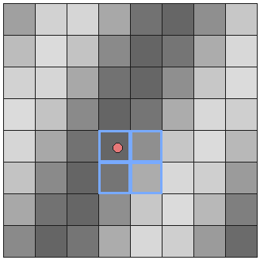

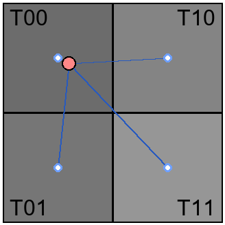

</div>

Dabei werden zunächst entlang **einer Achse** _lineare_ Zwischenwerte **berechnet** und anschließend entlang der **zweiten Achse kombiniert**. Das Ergebnis ist der **interpolierte Texturwert**:

$$
T(u,v) = T_{00}(1-u)(1-v) + T_{10}u(1-v) + T_{01}v(1-u) + T_{11}uv.
$$

Dieser **Wert** stellt den **gefilterten Höhenwert** der _Heightmap_ an der **Position** $(u,v)$ dar und wird direkt als Eingabe für die weitere Terrain-Generierung verwendet.


### Verfahren auf der CPU

Die vorherigen Abschnitte haben beschrieben, wie für eine Position innerhalb des Terrain-Gitters ein Noise-Wert bestimmt und anschließend über die Höhenfunktion in eine Weltkoordinate überführt wird. Auf dieser Grundlage können verschiedene Verfahren zur Erzeugung einer Terrain-Repräsentation aufgebaut werden.

Bei den nachfolgend vorgestellten _CPU_-basierten Verfahren erfolgt die Auswertung der Höhenwerte vollständig auf dem **Prozessor**. Die resultierende Geometrie wird vollständig erzeugt, bevor sie an die _GPU_ übertragen und **gerendert** wird. Der Vertex-Shader übernimmt dabei lediglich die _üblichen_ Transformationen innerhalb der **Rendering-Pipeline**.

#### Heightmap-Methode

<div class="method-demo-hero">

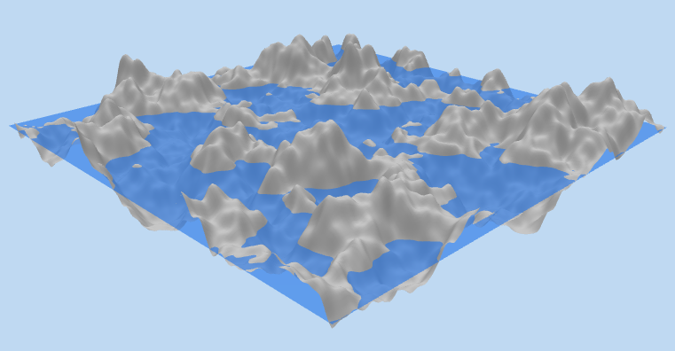

</div>

Die **Heightmap-Methode** gehört zu den am **häufigsten** verwendeten Verfahren zur Terrain-Generierung aus **Noise-Daten**. Dabei wird ein **zweidimensionaler Noise-Map** als Höheninformation interpretiert. Für jede Position $(x,z)$ wird **genau ein** Höhenwert $(y)$ bestimmt:

$$
\text{Noise}(x,z) \rightarrow y
$$

Das resultierende Terrain kann somit als Funktion $y=f(x,z)$ beschrieben werden. Jeder Position in der _horizontalen_ Ebene $(x,z)$ wird somit **genau eine** Höhe $(y)$ zugeordnet.

Der grundlegende Gedanke besteht darin, eine Noise-Map als **Höhenfeld** zu interpretieren. Helle Bereiche (_größe Werte_) der Noise-Daten entsprechen dabei **hohen Geländepunkten**, dunkle Bereiche (_kleine Werte_) **niedrigen Geländepunkten**. Aus dem zweidimensionalen Wertefeld entsteht dadurch eine **dreidimensionale Oberfläche**.

##### Erzeugung des Terrain-Meshes {#heightmap}

Zur Darstellung des Höhenfeldes wird zunächst ein **flaches Mesh** im $(xz)$-Raum erzeugt. In der Demonstation wird die Auflösung dieses Gitters durch den Parameter `Terrain Resolution` ($R \times R$) bestimmt.

Jeder **Gitterpunkt** entspricht einem **Vertex** des Terrain-Meshes. Für jeden dieser Punkte wird zunächst ein **Noise-Wert gesampelt**. Anschließend wird dieser Wert durch die Höhenfunktion in eine Weltkoordinate $(y)$ überführt.

Die berechneten **Höhenwerte** werden anschließend den **Vertices** des Meshes **zugewiesen**. Dadurch wird das ursprünglich **flache Gitter** entlang der Höhenachse **verformt** und bildet die Oberfläche des Terrains ab.

Zur Darstellung durch die _Grafikhardware_ werden die **Vertices**, wie in der Vorlesung beschrieben, über **Dreiecke miteinander verbunden**. Die erzeugte Geometrie wird anschließend an die _GPU_ übertragen und über die **Rendering-Pipeline** dargestellt.

Der Ablauf lässt sich vereinfacht wie folgt darstellen:

::: {.terrain-method-flow}
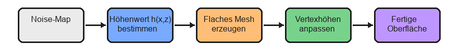
:::

Die folgende Demonstration zeigt die Anwendung der Heightmap-Methode zur Erzeugung einer Terrainoberfläche aus einer Noise-Map:

::: {.panel-tabset .terrain-param-panel}

## Höhenfunktion

<div class="terrain-height-sliders">

<div class="terrain-height-slider">
<label for="terrain-base-height-input">Base Height</label>
<input id="terrain-base-height-input" type="range" min="0" max="99" step="1" value="0">
<span class="terrain-height-slider-value" id="terrain-base-height-value">0</span>
</div>

<div class="terrain-height-slider">
<label for="terrain-maximum-height-input">Maximum Height</label>
<input id="terrain-maximum-height-input" type="range" min="1" max="100" step="1" value="40">
<span class="terrain-height-slider-value" id="terrain-maximum-height-value">40</span>
</div>

<div class="terrain-height-slider">
<label for="terrain-height-curve-input">Height Curve Exponent</label>
<input id="terrain-height-curve-input" type="range" min="0.1" max="3" step="0.1" value="1.5">
<span class="terrain-height-slider-value" id="terrain-height-curve-value">1.5</span>
</div>

<div class="terrain-height-slider">
<label for="terrain-height-level-input">Height Level</label>
<input id="terrain-height-level-input" type="range" min="0.05" max="0.95" step="0.05" value="0.5">
<span class="terrain-height-slider-value" id="terrain-height-level-value">0.50</span>
</div>

</div>

## Darstellung

<div class="terrain-height-sliders">

<div class="terrain-height-slider">
<label for="terrain-water-level-input">Water Level</label>
<input id="terrain-water-level-input" type="range" min="0" max="100" step="1" value="15">
<span class="terrain-height-slider-value" id="terrain-water-level-value">15</span>
</div>

</div>

<div class="terrain-display-options">
<div class="terrain-param-field terrain-display-options__resolution">
<label for="terrain-resolution-input">Terrain Resolution</label>
<select id="terrain-resolution-input">
  <option value="64">64 x 64</option>
  <option value="128" selected>128 x 128</option>
  <option value="256">256 x 256</option>
</select>
</div>

<div class="terrain-param-field terrain-param-field--checkbox terrain-display-options__wireframe">
<label for="terrain-wireframe-input">Wireframe Darstellung</label>
<input id="terrain-wireframe-input" type="checkbox">
</div>
</div>

## Generieren

<div class="terrain-param-actions">
  <button id="generate-heightmap-terrain">Terrain generieren</button>
</div>

:::

<div class="terrain-canvas-container">
  <canvas
    id="terrain-canvas"
    width="1200"
    height="700"
    style="
      width: 100%;
      height: 700px;
      border: 1px solid #444;
      border-radius: 8px;
    "
  >
  </canvas>
</div>

##### Eigenschaften der Methode

Da die Terrainhöhe ausschließlich durch die Funktion $y=f(x,z)$ beschrieben, kann für jede Position $(x,z)$ **nur ein einzelner** Höhenwert **existieren**.

Dies führt zu einer wichtigen Einschränkung der Heightmap-Methode: **Strukturen mit mehreren Höhenwerten an der selben Position können nicht dargestellt werden.** Dazu gehören insbesondere:

- Höhlen,
- Überhänge,
- natürliche Brücken,
- Tunnel oder
- vertikale Wände mit Rücksprüngen.

Solche Strukturen erfordern die Überlagerung von **mehreren Heightmaps** mit **verschiedenen** Noise-Maps oder **volumetrische Repräsentationen** wie Voxel- oder Dichtefelder, die im weiteren Verlauf vorgestellt werden.

Trotz dieser Einschränkung eignet sich die Heightmap-Methode sehr gut zur Darstellung **großflächiger Landschaften** wie:

- Ebenen,
- Hügel,
- Gebirgszüge,
- Täler oder
- Küstenlinien.

Die Heightmap-Methode wird in zahlreichen Spielen zur Terrain-Generierung in **abgewandelten Formen** eingesetzt. Ein bekanntes Beispiel sind frühe Versionen von Minecraft, bei denen die Terrainoberfläche auf einem Höhenfeld basierte.

##### Vor- und Nachteile

| Vorteile                                   | Nachteile                                          |
| ------------------------------------------ | -------------------------------------------------- |
| Einfache mathematische Berechnung          | Keine Höhlen oder Überhänge möglich                |
| Leicht zu implementieren                   | Genau ein Höhenwert pro Position $(x,z)$           |
| Geringer Implementierungsaufwand           | Detailgrad hängt direkt von der Gitterauflösung ab |
| Effiziente Darstellung großer Landschaften | Speicherbedarf steigt mit der Mesh-Auflösung       |
| Gut geeignet für CPU-basierte Generierung  | Mesh muss bei Änderungen neu erzeugt werden        |

Die Heightmap-Methode stellt damit eine vergleichsweise **einfache** und **effiziente** Methode in der **Terrain-Generierung** dar. Ihre größte Stärke liegt in der Möglichkeit der Darstellung **sehr großer Landschaftsoberflächen**, während **komplexe dreidimensionale Strukturen** nur **eingeschränkt** oder gar **nicht** abgebildet werden können.


#### Voxel-Density als Volumenmodell

<div class="method-demo-hero method-demo-hero--density">

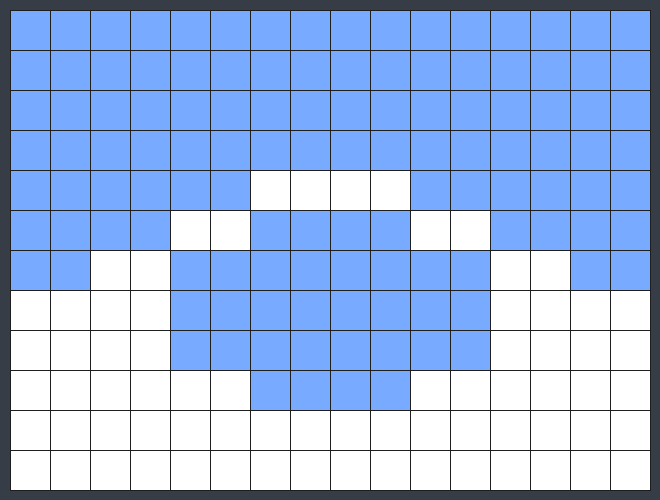

</div>

Im Gegensatz zur _Heightmap-Methode_ wird Terrain bei der **Voxel-Density-Methode** nicht als _Oberfläche_, sondern als **Volumen** modelliert. Anstelle eines **einzelnen Höhenwertes** für jede Position $(x, z)$ erhält jeder **Punkt** im Raum $(x, y, z)$ **einen Dichtewert** $\rho$:

$$
\mathrm{Noise}(x,y,z) \rightarrow \rho
$$

Das _resultierende_ Terrain wird somit nicht durch eine Funktion der Form $y=f(x,z)$ beschrieben. Stattdessen entsteht ein **dreidimensionales Dichtefeld**, das den **gesamten betrachteten Raumbereich** umfasst.

Der Ansatz besteht darin, jedem **Punkt** im Raum $(x, y, z)$ **einen Dichtewert** $\rho$ zuzuweisen. **Hohe Dichtewerte** entsprechen **festen Materialien**, während **niedrige Werte** als **Luft** interpretiert werden. Die sichtbare Terrainoberfläche entsteht an den **Übergängen zwischen** den Bereichen.

##### Erzeugung des Volumenmodells

Um **ein Dichtefeld** zu erzeugen, wird zunächst für **jede Position** $(x, y, z)$ ein **Noise-Wert einer dreidimensionalen Noise-Map** gesampelt. Dieser Wert beschreibt die _lokale_ **Materialdichte** für einen gegebenen **Punkt** im Raum und wird innerhalb eines **dreidimensionalen Gitters** gespeichert.

Da die Verarbeitung des **kontinuierlich** definierten Raumes **nicht effizient** möglich ist, erfolgt eine **Diskretisierung** in **einzelne Raumelemente**. Diese **diskreten Zellen** werden als **Voxel** bezeichnet und bilden die **räumliche Struktur** des Dichtefeldes. Jedem **Voxel** wird **genau ein** Dichtewert $\rho$ zugeordnet, der den Zustand des entsprechenden Raumbereichs beschreibt.

Anschließend wird eine **Schwelle** definiert, welche zwischen **festem Material** und **Luft** unterscheidet. Die **Oberfläche** des Terrains entsteht dort, wo das Dichtefeld diese **Schwelle überschreitet** beziehungsweise **unterschreitet**. Die entstehende **Grenzfläche** wird als **Isofläche** bezeichnet.

Der Ablauf lässt sich vereinfacht wie folgt darstellen:

::: {.terrain-method-flow}
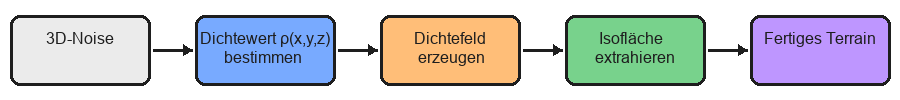
:::

Für größere Landschaften müssen spezielle Verfahren wie _Marching Cubes_ oder _Dual Contouring_ eingesetzt werden, um aus dem Dichtefeld eine zusammenhängende und **echtzeit renderbare** Oberfläche zu erzeugen. In diesen Methoden werden die **Isoflächen** aus dem Dichtefeld extrahiert und als **Polygonnetz** dargestellt.

<div class="sampling-figure-center">

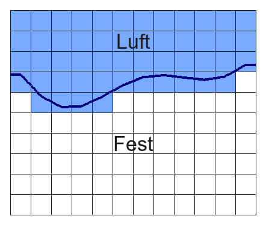

</div>

##### Eigenschaften der Methode

Da die Terrainrepräsentation auf einem **dreidimensionalen Dichtefeld** basiert, können **mehere Materialschichten** entlang der selben Position $(x,z)$ existieren. Dadurch lassen sich **komplexere Strukturen** darstellen, die bei einer _Heightmap_ nicht möglich sind, wie beispielsweise:

- Höhlen,
- Überhänge,
- natürliche Brücken,
- Tunnel oder
- komplexe Felsformationen.

Die Methode eignet sich daher besonders gut für Spielwelten mit **ausgeprägten unterirdischen Strukturen** oder **stark variierenden Geländeformen**.

In der Praxis wird die Methode in **angepasster Form** in modernen Spielen eingesetzt, um **weitläufige Höhlensysteme** und **komplexe Terrainstrukturen** effizient zu erzeugen.

##### Vor- und Nachteile
| Vorteile                                        | Nachteile                                            |
|-------------------------------------------------|------------------------------------------------------|
| Höhlen und Überhänge möglich                    | Höherer Speicherbedarf durch 3D-Daten                |
| Realistischere unterirdische Strukturen         | Höhere Rechenaufwand                                 |
| Mehrere Höhenwerte pro Position $(x,z)$ möglich | Zusätliche Verfahren zur Oberflächenextraktion nötig |
| Flexible Beschreibung komplexer Geometrien      | Deutlich höherer Implementierungsaufwand             |

Die **Voxel-Density-Methode** stellt eine **leistungsfähige** Erweiterung der klassischen _Heightmap-Generierung_ dar. Durch die _volumetrische_ Beschreibung des Terrains können deutlich **komplexere Landschaftsstrukturen** erzeugt werden. Gleichzeitig **erhöhen** sich jedoch **Speicherbedarf** und **Verarbeitungsaufwand** der Dichtefelder.


#### Voxel-Säulen

<div class="method-demo-hero">

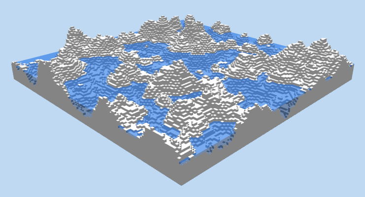

</div>

Die **Voxel-Säulen-Methode** stellt eine **diskrete Erweiterung** der _Heightmap-Methode_ dar. Beide Verfahren verwenden eine **zweidimensionale Noice-Map** sowie eine **Höhenfunktion** zur Bestimmung der Terrainhöhe. Der Unterschied liegt jedoch in der Verwendung des bestimmten Höhenwertes.

Während die _Heightmap-Methode_ ausschließlich die **sichtbare Terrainoberfläche** beschreibt, wird bei der _Voxel-Säulen-Methode_, wie der Name bereits vermuten lässt, das Terrain als Menge einzelner **Voxel** modelliert. Für jede Position $(x,z)$ wird zunächst eine Höhe bestimmt. Anschließend werden alle Raumbereiche **unterhalb des Höhenwertes** mit **Voxelblöcken** gefüllt.

Wie bei der _Heightmap_ ergibt sich die Terrainhöhe aus einer Funktion der Form

$$
\text{Noise}(x,z) \rightarrow h
$$

Das resultierende Terrain kann damit weiterhin als Funktion

$$
h=f(x,z)
$$

beschrieben werden. Im Gegensatz zur _Heightmap_ wird der **Höhenwert** jedoch **nicht direkt** zur _Positionierung_ eines Vertices verwendet, sondern zu Erzeugung einer **diskreten Blockstruktur** benutzt.

Unter Verwendung der **Voxelgröße** $s$ kann die **Belegung eines Voxels** an der Position $(x,y,z)$ durch die Funktion

$$
\operatorname{V}(x,y,z)=
\begin{cases}
1, & y \cdot s < \lfloor h(x,z) \rfloor \\
0, & \text{sonst}
\end{cases}
$$

beschrieben werden, wobei $1$ für einen **belegten Voxel** und $0$ für einen **unbelegten Voxel** steht.

Dadurch entsteht eine **blockbasierte Volumendarstellung**, deren Säulenhöhe aus der **Noise-Map** bestimmt wird.

##### Erzeugung der Voxelstruktur {#voxel}

Zur Erzeugung der Voxelstruktur wird zunächst für jede Position $(x,z)$ die zugehörige Terrainhöhe bestimmt. Diese Höhe definiert die **Anzahl** der entlang der y-Achse zu erzeugenden **Voxelzellen**.

Die **räumliche Diskretisierung** erfolgt dabei über die definierte **Voxelgröße** $s$. Sie bestimmt die _Kantenlänge_ eines einzelnen Voxels und legt somit fest, in welche diskreten Raumelemente das Terrain unterteilt wird. Eine **kleinere Voxelgröße** führt zu einer _feineren_ Auflösung und damit zu einer **höheren Anzahl** erzeugter Voxel.

Anschließend wird für **jede Terrainposition** eine vertikale _Voxel-Säule_ erzeugt. Dazu wird für **alle Voxelzellen** zwischen der **Grundebene** und der berechneten **Terrainhöhe** die Position in einer Voxelrepräsentation abgelegt. Mithilfe dieser Informationen kann die Voxelstruktur anschließend durch die **Rendering-Pipeline** gerendert werden.

Der Ablauf lässt sich vereinfacht wie folgt darstellen:

::: {.terrain-method-flow}
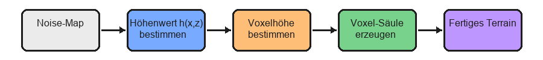
:::

Da die **Anzahl** der erzeugten Voxel sowohl von der **horizontalen Auflösung** als auch von der **maximalen Terrainhöhe** abhängt, wächst der **Speicher- und Rechenaufwand** mit der **Gesamtzahl** der erzeugten Blöcke. Im ungünstigsten Fall, also einem soliden Voxelblock über die gesamte Terrainhöhe, ergibt sich ein Aufwand von

$$
O(R^2 \cdot H)
$$

mit der Terrainauflösung $R$ und der maximalen Terrainhöhe $H$.

Zur Darstellung der Voxelzellen wird in der Demonstration **GPU-Instancing** verwendet. Dabei wird lediglich **ein einzelnes Würfel-Mesh** gespeichert und mehrfach mit _unterschiedlichen_ Transformationsdaten gerendert. Dadurch können **große Mengen** an Voxelblöcken dargestellt werden, **ohne** für jeden Block eine **eigene Geometrie** speichern zu müssen.

Die folgende Demonstration soll die Erzeugung der Voxelstruktur aus der Noise-Map und der Höhenfunktion veranschaulichen:

::: {.panel-tabset .terrain-param-panel}

## Höhenfunktion

<div class="terrain-height-sliders">

<div class="terrain-height-slider">
<label for="voxel-base-height-input">Base Height</label>
<input id="voxel-base-height-input" type="range" min="0" max="99" step="1" value="0">
<span class="terrain-height-slider-value" id="voxel-base-height-value">0</span>
</div>

<div class="terrain-height-slider">
<label for="voxel-maximum-height-input">Maximum Height</label>
<input id="voxel-maximum-height-input" type="range" min="1" max="100" step="1" value="40">
<span class="terrain-height-slider-value" id="voxel-maximum-height-value">40</span>
</div>

<div class="terrain-height-slider">
<label for="voxel-height-curve-input">Height Curve Exponent</label>
<input id="voxel-height-curve-input" type="range" min="0.1" max="3" step="0.1" value="1.5">
<span class="terrain-height-slider-value" id="voxel-height-curve-value">1.5</span>
</div>

<div class="terrain-height-slider">
<label for="voxel-height-level-input">Height Level</label>
<input id="voxel-height-level-input" type="range" min="0.05" max="0.95" step="0.05" value="0.5">
<span class="terrain-height-slider-value" id="voxel-height-level-value">0.50</span>
</div>

</div>

## Darstellung

<div class="terrain-height-sliders">

<div class="terrain-height-slider">
<label for="voxel-water-level-input">Water Level</label>
<input id="voxel-water-level-input" type="range" min="0" max="100" step="1" value="15">
<span class="terrain-height-slider-value" id="voxel-water-level-value">15</span>
</div>

</div>

<div class="terrain-param-field">
<label for="voxel-resolution-input">Voxel Resolution</label>
<select id="voxel-resolution-input">
  <option value="16">16 x 16</option>
  <option value="32" selected>32 x 32</option>
  <option value="64">64 x 64</option>
  <option value="128">128 x 128 (Performance kritisch)</option>
</select>
</div>

## Generieren

<div class="terrain-param-actions">
  <button id="generate-voxel-density">Voxel-Säulen generieren</button>
</div>

:::

<p id="voxel-performance-info">
  Voxel-Säulen sind deutlich rechenintensiver als Heightmap-Meshes, weil pro Säule
  viele Block-Instanzen erzeugt werden. Empfehlung: 16×16 oder 32×32 für flüssige
  Darstellung, 64×64 zum Vergleich, 128×128 nur auf leistungsstarken Geräten.
</p>

<div class="terrain-canvas-container">
  <canvas
    id="voxel-density-canvas"
    width="1200"
    height="700"
    style="
      width: 100%;
      height: 700px;
      border: 1px solid #444;
      border-radius: 8px;
    "
  ></canvas>
</div>

##### Eigenschaften der Methode

Da die Terrainhöhe weiterhin durch eine Funktion der Form

$$
h=f(x,z)
$$

beschrieben wird, existiert für jede Position $(x,z)$ **genau ein Höhenwert**. Die Methode übernimmt damit im Wesentlichen alle **Einschränkungen** der _Heightmap-Methode_.

Strukturen wie beispielsweise:	

- Höhlen,
- Überhänge,
- natürliche Brücken,
- Tunnel oder
- mehrschichtige Felsformationen

können nicht dargestellt werden.

Im Gegensatz zur _Heightmap_ besitzt die Methode jedoch eine **explizite Volumenrepräsentation**. Jeder Block existiert als **eigenständiges Raumelement** und kann **unabhängig** verändert, entfernt oder ergänzt werden. Dadurch eignet sich das Verfahren besonders für **blockartige Spielwelten** und **interaktive Terrainmanipulationen**.

Das Verfahren kann daher als Zwischenform zwischen der klassischen _Heightmap-Methode_ und volumetrischen Verfahren wie der _Voxel-Density-Methode_ betrachtet werden. Es **kombiniert** die **einfache Höhenbestimmung** eines Höhenfeldes mit der **diskreten Repräsentation** von Voxelen.

##### Vor- und Nachteile

| Vorteile                                            | Nachteile                                       |
| --------------------------------------------------- | ----------------------------------------------- |
| Einfache Erweiterung der Heightmap-Methode          | Keine Höhlen oder Überhänge möglich             |
| Intuitive blockbasierte Darstellung                 | Hoher Speicherbedarf bei großen Terrainhöhen    |
| Einzelne Blöcke können direkt verändert werden      | Anzahl der Voxel wächst mit der Terrainhöhe     |
| Gut geeignet für voxelbasierte Spielwelten          | Deutlich mehr Geometrie als bei einer Heightmap |
| Gleiche Höhenfunktion wie bei der Heightmap nutzbar | Detailgrad bleibt an das Höhenfeld gebunden     |

Die **Voxel-Säulen-Methode** stellt einen vergleichsweise **einfachen Einstieg** in die _voxelbasierte_ Terrain-Generierung dar. Sie verbindet die **unkomplizierte** Berechnung eines Höhenfeldes mit den Vorteilen einer **diskreten Blockrepräsentation**. Gleichzeitig übernimmt sie jedoch die Einschränkung der _Heightmap-Methode_, da weiterhin **nur ein Höhenwert** pro Position $(x,z)$ existieren kann. Für **komplexe dreidimensionale Strukturen** sind daher volumetrische Verfahren wie die _Voxel-Density-Methode_ besser geeignet.


### Verfahren auf der GPU

Im Gegensatz zu den zuvor vorgestellten _CPU_-basierten Verfahren erfolgt die Verarbeitung der **Terraininformationen** bei _GPU_-Methoden nicht vollständig während der **Weltgenerierung** auf der _CPU_. Stattdessen werden **vorbereitete Daten** oder **Ausgangsstrukturen** an die _Grafikkarte_ übertragen und dort mithilfe _spezialisierter_ **GPU-Programme**, insbesondere **Shadern**, weiterverarbeitet.

Durch die **parallele Verarbeitung** vieler Daten können **große Mengen** an Terraininformationen **effizient** bearbeitet werden. Die konkrete Position innerhalb der **Rendering-Pipeline** hängt dabei vom jeweiligen Verfahren ab. Während beispielsweise beim **Vertex-Displacement-Mapping** die Berechnung innerhalb des **Vertex-Shaders** erfolgt, können andere _GPU_-Verfahren auf beispielsweise **Compute- oder Tessellation-Shader** zurückgreifen.

Die nachfolgend vorgestellte Methode verwendet weiterhin die selben Höheninformationen und Parameter wie die zuvor beschriebenen Verfahren. Der Unterschied liegt ausschließlich darin, **wann**, **wo** und **wie** die **Höhenberechnung durchgeführt** wird.


#### Vertex-Displacement-Mapping

<div class="method-demo-hero">

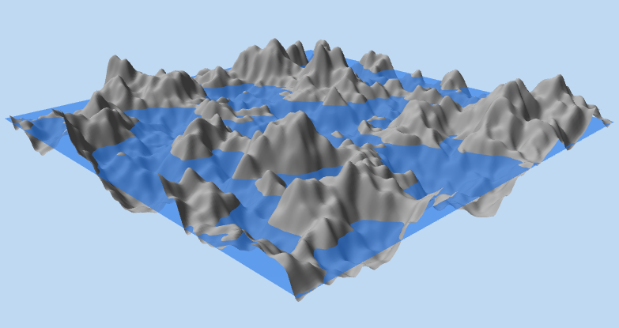

</div>

Beim **Vertex-Displacement-Mapping** wird die aus der **Noise-Map** berechnete Terrainhöhe **nicht bereits während** der **Weltgenerierung** in die Geometrie gespeichert, sondern **erst zur Laufzeit** in der **Rendering-Pipeline** auf der _GPU_ bestimmt.

Das Verfahren basiert auf der selben Grundidee wie die zuvor beschriebene **Heightmap-Methode**. Eine **zweidimensionale Noise-Map** wird weiterhin als Höheninformation interpretiert und jedem Punkt $(x,z)$ ein Höhenwert zugeordnet:

$$
\mathrm{Noise}(x,z) \rightarrow y
$$

Der **Unterschied** liegt jedoch in dem **Zeitpunkt und Ort der Auswertung**. Bei der _Heightmap_-Methode werden die Höhenwerte bereits auf der _CPU_ aus der **Noise-Map** gesampelt, in Vertexpositionen umgerechnet und anschließend als **fertige Terrain** an die _GPU_ übergeben. Beim Vertex-Displacement-Mapping hingegen bleibt das **Ausgangs-Mesh** **vollständig unverändert**, die Geometrie wird also **nicht vorab verändert**.

Stattdessen erfolgt die Berechnung der Höhenverschiebung direkt im **Vertex-Shader**. Hierzu werden die Höheninformationen **nicht mehr** als _Prozessor_-generierte Terrain-Geometrie übergeben, **sondern zur Laufzeit** aus einer **Graustufen-Textur** auf der _Grafikkarte_ gesampelt. Die **Textur** ist dabei lediglich eine **diskrete** Repräsentation der zuvor erzeugten **Noise-Daten**, welche vor den **Rendering-Schritten** in den _Grafikspeicher_ geladen wurde.


##### Anwendung des Vertex-Displacements {#displacement}

Für die Darstellung des Terrains wird zunächst ein **regelmäßiges**, **flaches Ground-Mesh** erzeugt. Dieses Mesh besitzt bereits die gewünschte Auflösung der späteren Terrainoberfläche, enthält jedoch **noch keine Höheninformationen**. Alle Vertices befinden sich somit anfangs auf einer gemeinsamen Ebene im $(x,z)$-Raum mit der Höhe $y_0$.

Jedem Vertex des Meshes werden zusätzlich **Textur-Koordinaten** zugewiesen. Diese normierten Koordinaten im Bereich $[0,1]$ beschreiben die Position **innerhalb** der Heightmap-Textur und stellen die **Verbindung** zwischen **Geometrie und gespeicherten Höhenwerten** her.

Während der Vertex-Verarbeitung wird diese **Zuordnung** genutzt, um den zugehörigen Höhenwert direkt aus der **Textur** zu bestimmen. Der Zugriff erfolgt dabei im **Vertex-Shader** über die bekannten **UV-Koordinaten**:

$$
v = \texttt{texture(heightMap, uv).r}
$$

Der dabei gelesene Wert $v$ stammt aus dem **R-Kanal** der **Graustufen-Textur** und entspricht einem normalisierten Höhenwert im Bereich $[0,1]$. Wie im Abschnitt `Sampling auf der GPU` beschrieben, kann dieser Wert durch die _GPU_ bereits zwischen **benachbarten Texeln** interpoliert werden, sodass keine rein **diskrete** Abtastung der Heightmap-Textur erfolgt.

Der so erhaltene **Texturwert** $v$ wird anschließend als Eingabe für eine **Höhenfunktion** $H(v)$ verwendet, welche ihn in eine Weltkoordinate $y$ projiziert:

$$
y = H(v)
$$

Die berechnete Höhe wird direkt auf die **y-Komponente** der **Vertexposition** angewendet:

$$
(x,y_0,z)
\rightarrow
(x,y_0+h,z)
$$

Dabei steht $h$ für die aus dem **Heightmap-Wert** abgeleitete **Höhenverschiebung** $h = H(v) - y_0$. Auf diese Weise wird das ursprünglich **flache Grid** in eine **dreidimensionale Terrainoberfläche** überführt.

Der Gesamtablauf lässt sich vereinfacht wie folgt darstellen:

::: {.terrain-method-flow}
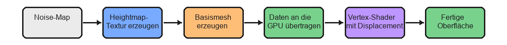
:::

Wie aus der Vorlesung breits bekannt, verändert der **Vertex-Shader** ausschließlich bereits **existierende** **Vertexpositionen**, erzeugt jedoch **keine neue Geometrie**. Dadurch bleibt die **Topologie** des ursprünglichen Meshes vollständig **erhalten**.

Die Anzahl der Vertices sowie der Fragmente entsprechen weiterhin exakt dem Ausgangs-Mesh. Lediglich die Position der Geometrie-Elemente im Raum wird pro **Shader-Ausführung** neu bestimmt.

Die in der Demonstration verwendete Höhenfunktion ist identisch zur im Abschnitt `Von der Noise-Map zur Höhe` beschriebenen Funktion. Dadurch bleibt das resultierende Terrain mit den _CPU_-basierten Verfahren direkt vergleichbar.

Für eine korrekte **Beleuchtung** der deformierten Oberfläche müssen außerdem geeignete **Oberflächennormalen** bestimmt werden. In der interaktiven Darstellung werden diese aus **benachbarten** Höhenwerten der Heightmap mithilfe **finiter Differenzen** berechnet. Der **Fragment-Shader** verwendet anschließend diese Normalen für die **Beleuchtung** der Oberfläche.

Die folgende Veranschaulichung zeigt die Anwendung des **Vertex-Displacement-Mappings**, welche die selbe Höhenfunktion wie bei der **Heightmap-Methode** verwendet:

::: {.panel-tabset .terrain-param-panel}

## Terrain-Parameter

<div class="terrain-height-sliders">

<div class="terrain-height-slider">
<label for="vertex-shader-base-height-input">Base Height</label>
<input id="vertex-shader-base-height-input" type="range" min="0" max="99" step="1" value="0">
<span class="terrain-height-slider-value" id="vertex-shader-base-height-value">0</span>
</div>

<div class="terrain-height-slider">
<label for="vertex-shader-maximum-height-input">Maximum Height</label>
<input id="vertex-shader-maximum-height-input" type="range" min="1" max="100" step="1" value="40">
<span class="terrain-height-slider-value" id="vertex-shader-maximum-height-value">40</span>
</div>

<div class="terrain-height-slider">
<label for="vertex-shader-height-curve-input">Height Curve Exponent</label>
<input id="vertex-shader-height-curve-input" type="range" min="0.1" max="3" step="0.1" value="1.5">
<span class="terrain-height-slider-value" id="vertex-shader-height-curve-value">1.5</span>
</div>

<div class="terrain-height-slider">
<label for="vertex-shader-height-level-input">Height Level</label>
<input id="vertex-shader-height-level-input" type="range" min="0.05" max="0.95" step="0.05" value="0.5">
<span class="terrain-height-slider-value" id="vertex-shader-height-level-value">0.50</span>
</div>

</div>

## Darstellung

<div class="terrain-height-sliders">

<div class="terrain-height-slider">
<label for="vertex-shader-water-level-input">Water Level</label>
<input id="vertex-shader-water-level-input" type="range" min="0" max="100" step="1" value="15">
<span class="terrain-height-slider-value" id="vertex-shader-water-level-value">15</span>
</div>

</div>

<div class="terrain-display-options">
<div class="terrain-param-field terrain-display-options__resolution">
<label for="vertex-shader-resolution-input">Terrain Resolution</label>
<select id="vertex-shader-resolution-input">
  <option value="64">64 x 64</option>
  <option value="128" selected>128 x 128</option>
  <option value="256">256 x 256</option>
</select>
</div>

<div class="terrain-param-field terrain-param-field--checkbox terrain-display-options__wireframe">
<label for="vertex-shader-wireframe-input">Wireframe Darstellung</label>
<input id="vertex-shader-wireframe-input" type="checkbox">
</div>
</div>

## Generieren

<div class="terrain-param-actions">
  <button id="generate-vertex-shader-terrain">Terrain generieren</button>
</div>

:::

<div class="terrain-canvas-container">
  <canvas
    id="vertex-shader-canvas"
    width="1200"
    height="700"
    style="
      width: 100%;
      height: 700px;
      border: 1px solid #444;
      border-radius: 8px;
    "
  >
  </canvas>
</div>

<details class="code-details">
<summary>Code-Erklärung: Vertices und UV-Koordinaten</summary>

Die **UV-Koordinaten** eines **Babylon.js**-Ground-Meshes besitzen nicht die selbe Orientierung wie die erzeugte Heightmap. Daher wird die y-Koordinate vor dem Sampling im Shader **invertiert**. **Ohne** diese Korrektur würde das Terrain entlang der y-Achse **gespiegelt** dargestellt werden.

```glsl
vec2 fixedUV = vec2(uv.x, 1.0 - uv.y);
```

</details>

<details class="code-details">
<summary>Code-Erklärung: Normalenberechnung für die Beleuchtung</summary>

Da in **Babylon.js** bei der Verwendung eines `ShaderMaterials` sowohl ein **Vertex-** als auch ein **Fragment-Shader** definiert werden **müssen**, erfolgt die Berechnung der Oberflächennormalen bereits im **Vertex-Shader**, da **ohne Beleuchtung** die Höhenunterschiede der deformierten Terrainoberfläche **kaum erkennbar** wären und erst durch die Beleuchtung im **Fragment-Shader** sichtbar werden.

**Drei Schritte:**

1. Benachbarte Höhenwerte sampeln
2. Daraus lokale Steigungen bestimmen
3. Einen Normalenvektor für die Beleuchtung berechnen

```glsl
float hL = sampleTerrainHeight(texture2D(heightMap, fixedUV + vec2(-texelSize, 0.0)).r);
float hR = sampleTerrainHeight(texture2D(heightMap, fixedUV + vec2(texelSize, 0.0)).r);
float hD = sampleTerrainHeight(texture2D(heightMap, fixedUV + vec2(0.0, -texelSize)).r);
float hU = sampleTerrainHeight(texture2D(heightMap, fixedUV + vec2(0.0, texelSize)).r);
```

Für die Berechnung der **Oberflächennormalen** werden **vier** _benachbarte_ Heightmap-Werte im **Vertex-Shader** gesampelt. Aus den Höhenunterschieden können die _lokalen_ **Steigungen** der Terrainoberfläche bestimmt werden.

```glsl
vec3 normalObj = normalize(vec3(hL - hR, 2.0 * worldStep, hD - hU));
```

Aus den **Steigungen** wird anschließend ein **Normalenvektor** berechnet. Dieser beschreibt die **Orientierung** der Oberfläche und wird an den **Fragment-Shader** übergeben.

```glsl
float diffuse = max(dot(nrm, normalize(-lightDirection)), 0.0);
```

Der **Fragment-Shader** verwendet die berechnete Normale für eine **einfache diffuse Beleuchtung**. Dadurch werden Hänge, Kanten und Höhenunterschiede der deformierten Terrainoberfläche **deutlich besser** sichtbar.

</details>

##### Eigenschaften der Methode

Da das Verfahren weiterhin auf einem **zweidimensionalen Höhenfeld** basiert, besitzt jeder Punkt $(x,z)$ weiterhin **genau einen** Höhenwert. Damit gelten **die selben** geometrischen **Einschränkungen** wie bei der **Heightmap-Methode**.

Strukturen wie beispielsweise:

- Höhlen,
- Überhänge,
- natürliche Brücken,
- Tunnel oder
- mehrschichtige Felsformationen

können daher **nicht** dargestellt werden.

Der wesentliche Unterschied gegenüber der _CPU_-basierten **Heightmap-Methode** liegt in der **Verlagerung** der Höhenanwendung auf der _Grafikkarte_. Da viele Vertices **parallel verarbeitet** werden können, eignet sich das Verfahren besonders gut für **große Terrainflächen mit hoher Terrainauflösung**.

Gleichzeitig bleibt die Geometrie des **Ausgangs-Meshes** **unverändert**. Der **Vertex-Shader** kann **nur vorhandene** Vertices verschieben, jedoch **keine zusätzlichen** Vertices oder Flächen **erzeugen**. Dadurch ist die Methode auf **kontinuierliche Oberflächen** beschränkt.

##### Vor- und Nachteile

| Vorteile                                                   | Nachteile                                        |
| -----------------------------------------------------------| ------------------------------------------------ |
| Parallele Berechnung vieler Vertices auf der GPU           | Vertex-Shader kann keine neue Geometrie erzeugen |
| Entlastung der CPU bei großen Gittern                      | Höhere GPU-Auslastung                            |
| Gleiche Höhenfunktion wie CPU-basierte Verfahren nutzbar   | Benötigt Heightmap als GPU-Textur                |
| Typisches Verfahren für Echtzeit-fähiges Terrain-Rendering | Keine Höhlen oder Überhänge möglich              |
| Geringer Speicheraufwand für Terrain-Geometrie             | Unterschiede durch GPU-Sampling möglich          |

Das **Vertex-Displacement-Mapping** stellt damit eine _GPU_-basierte Alternative zur klassischen _Heightmap_-Generierung dar. Während die Terrainbeschreibung gleichbleibt, erfolgt die Berechnung der Höhenverschiebung nicht mehr auf der _CPU_ sondern im _Vertex-Shader_.

Dadurch können **große Terrainflächen** effizient dargestellt werden, während die Methode gleichzeitig die **Einschränkungen** eines **zweidimensionalen Höhenfeldes** beibehält.


### Zusammenfassung der Verfahren

Die in diesem Kapitel vorgestellten Verfahren zeigen, dass zwischen einer **Noise-Map** und einer **sichtbaren Landschaft** mehrere notwendige Verarbeitungsschritte liegen. Die Noise-Map liefert dabei am Anfang nur ein **Feld von Zahlenwerten**. Erst durch die Interpretation der Noise-Werte kann eine **Terrainoberfläche** erzeugt werden.

Jede Methode hat dabei unterschiedliche Eigenschaften und Gründe für ihre Verwendung:

| Aspekt                             | Heightmap          | Voxel-Säulen         | Voxel-Density              | Vertex-Displacement-Mapping       |
| ---------------------------------- | ------------------ | -------------------- | -------------------------- | --------------------------------- |
| Berechnungsort                     | CPU                | CPU                  | CPU                        | Vertex-Shader (GPU)               |
| Benötigte Noise-Map                | 2D                 | 2D                   | 3D                         | 2D                                |
| Darstellungsform                   | Mesh               | Voxelstruktur        | Voxelstruktur              | Deformiertes Mesh                 |
| Ein Höhenwert pro Position $(x,z)$ | Ja                 | Ja                   | Nein                       | Ja                                |
| Höhlen und Überhänge               | Nein               | Nein                 | Ja                         | Nein                              |
| Speicherbedarf                     | Gering             | Mittel bis Hoch      | Hoch                       | Gering                            |
| Rechenaufwand                      | Gering             | Mittel               | Hoch                       | Geringe CPU-, höhere GPU-Last     |
| Typische Stärke                    | Große Landschaften | Blockbasierte Welten | Komplexe Volumenstrukturen | Echtzeitfähiges Terrain-Rendering |

Obwohl sich die Ansätze hinsichtlich ihrer Darstellung und technischen Umsetzung unterscheiden, verfolgen sie **die selben Gedanken**: Für eine Position wird **ein Noise-Wert** bestimmt und anschließend in **ein Terrain** überführt. Die Unterschiede liegen dabei nicht in den vorhandenen Daten, sondern in deren **Verwendung** und **Darstellung**.

Die Wahl der Darstellungsform beeinflusst, welche Landschaftsformen dargestellt werden können, wie hoch der Speicher- und Rechenaufwand ist und an welcher Stelle die Verarbeitung erfolgt. Während **höhenfeldbasierte Verfahren** vor allem für **kontinuierliche Oberflächen** geeignet sind, ermöglichen **volumetrische Methoden** die Beschreibung **komplexerer dreidimensionaler Strukturen**.

Damit wurden mehrere Wege vorgestellt, mit denen aus einer Noise-Map eine Terraingeometrie erzeugt werden kann. Die erzeugten Meshes oder Voxelstrukturen beschreiben jedoch nur die **räumliche Form einer Landschaft**. Für die weitere Darstellung müssen diese Geometrien anschließend mit zusätzlichen Oberflächeneigenschaften versehen werden, welche ihr späteres Erscheinungsbild maßgeblich bestimmen.


## Terrain Texturierung mit Texture Maps und Texture Algorithmen {#texture}

###  Erklärung und Einordnung in die Rendering Pipeline

Nach der Erzeugung der Terrain-Geometrie durch Heightmaps und deren Darstellung via Vertex-Shadern erfolgt die visuelle Ausgestaltung durch spezialisierte Shader-Stages und Materialzuweisungsalgorithmen. Im Gegensatz zur Geometriegenerierung (CPU oder Tessellation) behandelt dieser Abschnitt die Fragment-Level-Texturierung, also die Bestimmung von Oberflächenfarben und Materialeigenschaften.

### Rolle der Tessellation-Shaders im Terrain-Rendering

Im klassischen Rendering-Workflow stellte die CPU oft den zentralen Bottleneck dar: Wollte man ein hochdetailliertes Terrain darstellen, musste die CPU Millionen von Dreiecken generieren und pro Frame an die GPU senden. Dies blockierte wertvolle Bandbreite auf dem PCIe-Bus.

Die Tessellation-Stufe löst dieses Problem, indem sie eine grobe Geometrie (sogenannte **Patches**) entgegennimmt und diese autonom, hochgradig parallelisiert auf der GPU in feinste Dreiecksnetze zerlegt.

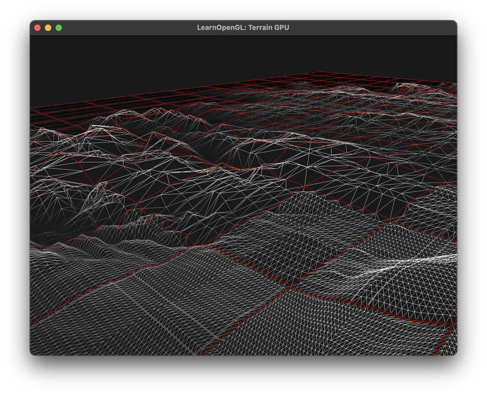{width="70%"}

###  Tessellation Control Shader (TCS) / Hull Shader

Der Tessellation Control Shader (TCS) bildet die Kontrollinstanz dieser Pipeline-Stufe und wird für jeden Kontrollpunkt eines eingehenden Patches ausgeführt.

**Relevanz für das Terrain:**
In dieser Stufe wird das **Level of Detail (LoD)** dynamisch bestimmt. Dazu berechnet der Shader anhand einer Abstandsfunktion die Distanz zwischen Terrain-Patch und Kamera und passt die Tessellationsfaktoren entsprechend an:

- **Nah an der Kamera:** Hohe Tessellationsfaktoren für maximale geometrische Detailtreue.
- **Weit von der Kamera entfernt:** Niedrige Tessellationsfaktoren zur Reduzierung des Rechenaufwands und zur Verbesserung der Performance.

Dadurch werden nur die sichtbaren und relevanten Bereiche des Terrains mit hoher Detailstufe dargestellt, während entfernte Bereiche vereinfacht gerendert werden.

###  Tessellation Primitive Generator (TPG)

Der Tessellation Primitive Generator (TPG) ist **kein programmierbarer Shader**, sondern eine fest in der Grafikhardware implementierte Einheit (*Fixed-Function Stage*).

**Hauptaufgabe:**
Der TPG übernimmt die vom Tessellation Control Shader (TCS) berechneten Tessellationsfaktoren und führt die eigentliche Unterteilung des Patches durch. Dabei erzeugt er ein feines Gitter aus topologischen Primitiven (z. B. Dreiecken oder Quads) innerhalb der ursprünglichen Fläche.

**Ausgabe:**
Für jeden neu erzeugten Vertex berechnet der TPG relative, normierte Koordinaten innerhalb des Patches. Diese werden als **baryzentrische Koordinaten** bezeichnet und typischerweise in der Form

- $(u, v)$ für quadratische Patches oder
- $(u, v, w)$ für dreieckige Patches

bereitgestellt.

Diese Koordinaten dienen als Eingabe für den nachfolgenden Tessellation Evaluation Shader (TES), der daraus die endgültigen Vertexpositionen im Raum berechnet.

###  Tessellation Evaluation Shader (TES) / Domain Shader

Der Tessellation Evaluation Shader (TES) ist eine vollständig programmierbare Shader-Stufe und wird für **jeden einzelnen** vom Tessellation Primitive Generator (TPG) erzeugten Vertex ausgeführt.

**Hauptaufgabe:**
Der TES erhält die vom TPG berechneten baryzentrischen Koordinaten und verwendet diese zur Interpolation der ursprünglichen Kontrollpunkte des Patches. Auf diese Weise wird die endgültige Position jedes neuen Vertex im World- oder Clip-Space berechnet.

**Displacement Mapping:**
In dieser Phase wird die eigentliche **Heightmap** (Höhentextur) ausgewertet. Die zuvor tessellierte, jedoch noch flache Geometrie wird anhand der Höheninformationen verformt. Dazu verschiebt der Shader jeden Vertex entlang seines Normalenvektors entsprechend dem aus der Heightmap gelesenen Höhenwert.

Die neue Vertexposition ergibt sich aus:

$$
\vec{P}_{\text{neu}} =
\vec{P}_{\text{interpoliert}}
+
\vec{N} \cdot \text{Heightmap}(u,v)
$$

wobei

- $\vec{P}_{\text{interpoliert}}$ die durch Interpolation berechnete Position des Vertex ist,
- $\vec{N}$ den zugehörigen Normalenvektor beschreibt und
- $\text{Heightmap}(u,v)$ den Höhenwert an der Texturkoordinate $(u,v)$ liefert.

Durch diese Verschiebung entsteht aus einer einfachen, niedrig aufgelösten Grundfläche ein detailliertes Terrain mit realistischen Höhenstrukturen, ohne dass die Geometrie bereits im Modell gespeichert werden muss.

---

### Vorteile:
1. **Kontinuierliches Level of Detail (Continuous LoD):** Da die Unterteilung pro Frame berechnet wird, erscheinen Geometrien nicht abrupt auf sondern verfeinern sich fließend bei Annäherung.
2. **Echte geometrische Silhouetten:** Im Gegensatz zu reinem *Bump-* oder *Normal-Mapping* (welches dem Fragment Shader eine dreidimensionale Struktur nur über Beleuchtungsartefakte simuliert) verändert Tessellation die **reale Geometrie**. Bergkanten werfen echte Schatten und sind auch bei flachen Blickwinkeln physikalisch zerklüftet.

### Nachteile :
1. **Overtessellation:** Wenn Dreiecke durch zu hohe Faktoren kleiner als ein einzelner Pixel auf dem Bildschirm werden, arbeitet die Rasterisierung extrem ineffizient. Die Faktoren müssen daher adaptiv nach oben gedeckelt werden.
2. **Nahtstellen (Cracking):** Wenn zwei benachbarte Patches aufgrund unterschiedlicher Kameraabstände differente Tessellationsfaktoren berechnen, können mathematische Lücken und sichtbare Risse im Terrain entstehen. Der TCS muss algorithmisch sicherstellen, dass gemeinsam genutzte Kanten exakt dieselben Außen-Tessellationsfaktoren zugewiesen bekommen.

>  ** WebGL-Implementierung:**
> Da WebGL 2.0 (und damit das hier genutzte Babylon.js) nativ keine Tessellation Shader unterstützt, wird dieses Verhalten in Web-Anwendungen meist über hochaufgelöste, vor-unterteilte Geometrien gelöst. In modernen Desktop-APIs (Vulkan, DirectX 12) oder dem kommenden WebGPU-Standard ist die Tessellation-Stufe jedoch der Standardweg für performantes Terrain-Rendering.


## Rolle des Fragment-Shaders in der Terrain-Texturierung {#fragment}

Der Fragment-Shader bildet die finale, programmierbare Stufe der Rendering-Pipeline vor dem Framebuffer-Vorgang. Während vorherige Stufen (Vertex- und Tessellation-Shader) die topologische Struktur des Terrains definieren, operiert der Fragment-Shader auf Pixelebene.

Nach dem Vertex-Shader liegen folgende Informationen vor:

- **Vertex-Position** (nach GPU-Verschiebung)
- **Oberflächennormale** (berechnet aus Nachbartexeln)
- **UV-Koordinaten** (Textur-Mapping)
- **Lichtvektoren** (Richtung zum Licht)

Der Fragment-Shader nutzt diese Daten, um:

1. **Materialfarben** abhängig von Höhe oder Steigung zu bestimmen
2. **Diffuse und spekulare Beleuchtung** zu berechnen
3. **Normal Mapping** oder andere Oberflächendetails anzuwenden

## Visuelle Darstellung der Terrain Texturierung {#visuell}

### Nach Höhe (Height-based Coloring)

Das einfachste und am häufigsten verwendete Verfahren ist die Einfärbung basierend auf der Höhe. Dabei wird der Höhenwert in verschiedene Bereiche unterteilt, wie zum Beispiel:

- **Sand:** Gelb (Höhe $15 - 25$)
- **Gras:** Grün (Höhe $25 - 40$)
- **Felsen:** Grau (Höhe $> 40$)
- **Schnee:** Weiß (Höhe $> 50$)


### Übergänge zwischen Materialien

Harte Übergänge zwischen den Höhenstufen wirken oft unrealistisch. Daher werden weiche Übergänge eingesetzt:

- **`smoothstep()`**
  Sorgt für eine sanfte Interpolation innerhalb eines definierten Höhenbereichs und verhindert harte Kanten.

- **`mix()`**
  Führt eine lineare Interpolation zwischen zwei Farben oder Materialien basierend auf einem Gewichtungsfaktor durch.

### Nach Zeit

Das Day/Night-Shader-System demonstriert, wie die **Uniform-Variable `timeOfDay`** den visuellen Eindruck der Terrain-Oberfläche verändert, ohne die Geometrie zu manipulieren. Der Fragmentshader bezieht den Lichtvektorsatz und berechnet diffuse Beleuchtung basierend auf der Oberflächennormalen:

```glsl
lightDirection = normalize(vec3(cos(time * 2π), sin(time * 2π), -0.3))
diffuse = max(dot(normal, lightDirection), 0.0)
finalColor = materialColor * diffuse
```

Dies führt zu dramatischen visuellen Veränderungen:
- **Mittag (time = 0.25)**: Licht von vorne → helle, kontrastreich Oberfläche
- **Sonnenuntergang (time = 0.5)**: Licht von der Seite → warme, lange Schatten
- **Nacht (time = 0.75)**: Licht von hinten → dunkle, mystische Atmosphäre
- **Sonnenaufgang (time = 1.0)**: Wiederholung des Lichtwechsels


**Praktische Implikation für Echtzeit-Rendering**: Kamera und Lichtsystem müssen unabhängig sein. Der Fragment-Shader nutzt nur den Lichtvektorsatz und die Normalen nicht die Kameraposition. Dies ermöglicht freies Kameraschwenken ohne künstliche Lichtverluste.


### Vertex-Displacement mit Day/Night-Shader {#displacement-shader}

::: {.panel-tabset .terrain-param-panel}

## Höhenfunktion

<div class="terrain-height-sliders">

<div class="terrain-height-slider">
<label for="day-night-shader-base-height-input">Base Height</label>
<input id="day-night-shader-base-height-input" type="range" min="0" max="99" step="1" value="0">
<span class="terrain-height-slider-value" id="day-night-shader-base-height-value">0</span>
</div>

<div class="terrain-height-slider">
<label for="day-night-shader-maximum-height-input">Maximum Height</label>
<input id="day-night-shader-maximum-height-input" type="range" min="1" max="100" step="1" value="40">
<span class="terrain-height-slider-value" id="day-night-shader-maximum-height-value">40</span>
</div>

<div class="terrain-height-slider">
<label for="day-night-shader-height-curve-input">Height Curve Exponent</label>
<input id="day-night-shader-height-curve-input" type="range" min="0.1" max="3" step="0.1" value="1.5">
<span class="terrain-height-slider-value" id="day-night-shader-height-curve-value">1.5</span>
</div>

<div class="terrain-height-slider">
<label for="day-night-shader-height-level-input">Height Level</label>
<input id="day-night-shader-height-level-input" type="range" min="0.05" max="0.95" step="0.05" value="0.5">
<span class="terrain-height-slider-value" id="day-night-shader-height-level-value">0.50</span>
</div>

</div>

## Darstellung

<div class="terrain-height-sliders">

<div class="terrain-height-slider">
<label for="day-night-shader-water-level-input">Water Level</label>
<input id="day-night-shader-water-level-input" type="range" min="0" max="100" step="1" value="15">
<span class="terrain-height-slider-value" id="day-night-shader-water-level-value">15</span>
</div>

</div>

<div class="terrain-display-options">
<div class="terrain-param-field terrain-display-options__resolution">
<label for="day-night-shader-resolution-input">Terrain Resolution</label>
<select id="day-night-shader-resolution-input">
  <option value="64">64 x 64</option>
  <option value="128" selected>128 x 128</option>
  <option value="256">256 x 256</option>
</select>
</div>

<div class="terrain-param-field terrain-param-field--checkbox terrain-display-options__wireframe">
<label for="day-night-shader-wireframe-input">Wireframe Darstellung</label>
<input id="day-night-shader-wireframe-input" type="checkbox">
</div>
</div>

## Generieren

<div class="terrain-param-actions">
  <button id="generate-day-night-shader-terrain">Terrain generieren</button>
</div>

:::

<div class="terrain-canvas-container">
  <canvas
    id="day-night-shader-canvas"
    width="1200"
    height="700"
    style="
      width: 100%;
      height: 700px;
      border: 1px solid #444;
      border-radius: 8px;
    "
  >
  </canvas>
</div>


```{=html}
<div class="daynight-controls" style="margin-top: 0.5rem;">
  <button id="toggle-daynight-shader-main">Fragment Shader: Aus</button>
  <button id="toggle-daynight-cycle-main" style="margin-left:8px;">Day/Night Cycle: Aus</button>
  <span id="daynight-status-main" style="margin-left:12px;color:#666"></span>
  <div style="display:inline-block; margin-left:16px; vertical-align:middle;">
    <label for="daynight-speed-slider-main" style="font-size:0.9rem; margin-right:6px;">Cycle Speed:</label>
    <input id="daynight-speed-slider-main" type="range" min="0" max="5" step="0.1" value="1" style="vertical-align:middle;">
    <span id="daynight-speed-value-main" style="margin-left:6px; font-size:0.9rem; color:#333">1.0x</span>
  </div>
</div>

<script>
document.addEventListener("DOMContentLoaded", function () {
  const shaderBtn = document.getElementById('toggle-daynight-shader-main')
  const cycleBtn = document.getElementById('toggle-daynight-cycle-main')
  const status = document.getElementById('daynight-status-main')

  function updateShaderText(enabled) {
    shaderBtn.textContent = enabled ? 'Day/Night Shader: Ein' : 'Day/Night Shader: Aus'
  }

  function updateCycleText(enabled) {
    cycleBtn.textContent = enabled ? 'Day/Night Cycle: Ein' : 'Day/Night Cycle: Aus'
    status.textContent = enabled ? 'Cycle aktiviert' : 'Cycle deaktiviert'
  }

  shaderBtn.addEventListener('click', () => {
    if (window.toggleDayNightShader) {
      try {
        const enabled = window.toggleDayNightShader()
        updateShaderText(enabled)
      } catch (e) {
        console.error('Fehler beim Umschalten des Shaders:', e)
      }
    }
  })

  cycleBtn.addEventListener('click', () => {
    if (window.toggleDayNightCycle) {
      const enabled = window.toggleDayNightCycle()
      updateCycleText(enabled)
    }
  })

  // Speed slider
  const speedSlider = document.getElementById('daynight-speed-slider-main')
  const speedValueText = document.getElementById('daynight-speed-value-main')

  function updateSpeedDisplay(mult) {
    speedValueText.textContent = (Number(mult) || 0).toFixed(1) + 'x'
  }

  if (speedSlider) {
    speedSlider.addEventListener('input', (ev) => {
      const val = Number(ev.target.value)
      updateSpeedDisplay(val)
      if (window.setDayNightSpeedMultiplier) {
        try {
          window.setDayNightSpeedMultiplier(val)
        } catch (e) {
          console.error('Failed to set day/night speed multiplier', e)
        }
      }
    })

    // initialize from runtime state if available
    if (window.getDayNightSpeedMultiplier) {
      const current = window.getDayNightSpeedMultiplier()
      if (typeof current === 'number') {
        speedSlider.value = current
        updateSpeedDisplay(current)
      }
    }
  }

  // initialize labels from runtime state if available
  if (window.isDayNightShaderActive) {
    updateShaderText(window.isDayNightShaderActive())
  }

  if (window.isDayNightCycleEnabled) {
    updateCycleText(window.isDayNightCycleEnabled())
  }
})
</script>
```


# Fazit {#fazit}

## Zusammenfassung der Ergebnisse {#fazit1}


```{mermaid}
flowchart LR
    A[Seed]
    B[Noise Generation]
    C[Height Map]
    D[Terrain Mesh]
    E[Texturing]
    F[Final Landscape]

    A --> B --> C --> D --> E --> F
```

Die Untersuchung hat gezeigt, dass die prozedurale Terrain-Generierung eine leistungsfähige Methode zur Erzeugung großer und variantenreicher virtueller Welten darstellt. Im Gegensatz zu klassisch gespeicherten Höhen- und Texturdaten werden Landschaften hierbei algorithmisch erzeugt, wodurch sich Speicherbedarf und Datenübertragungsaufwand erheblich reduzieren lassen.


1. Generierung einer Noise-Map mittels Compute Shadern

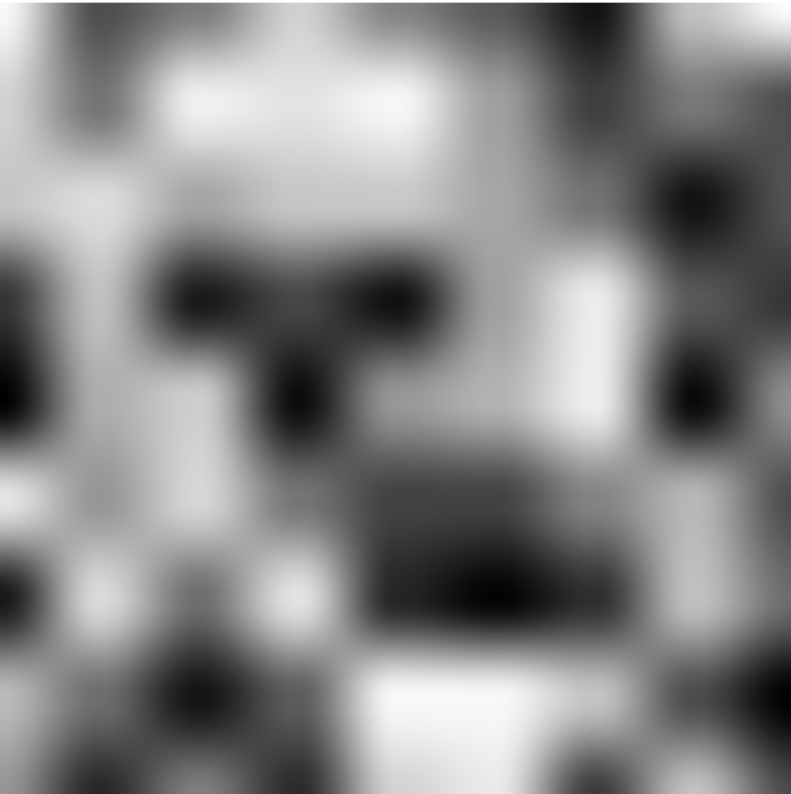{ width=50% }

2. Umwandlung der Höheninformationen in Geometrie durch Vertex- und Geometry-Shader

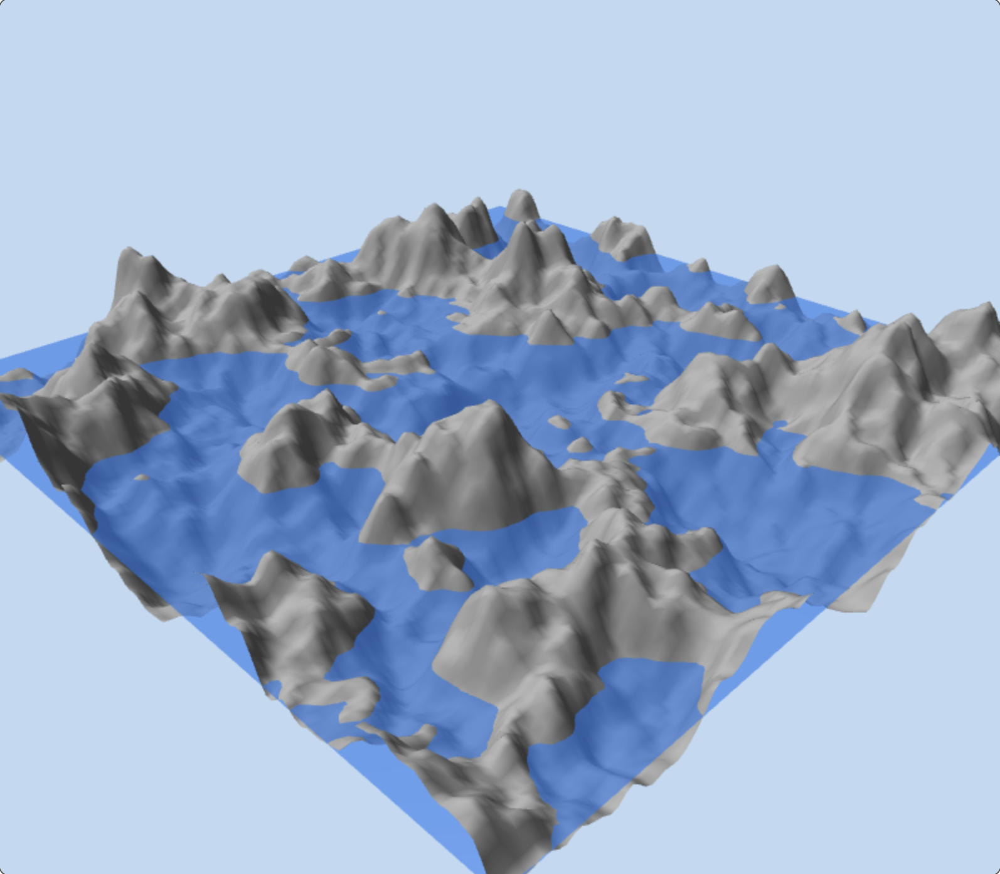{ width=50% }

3. Texturierung und Verfeinerung durch Fragment-Shader

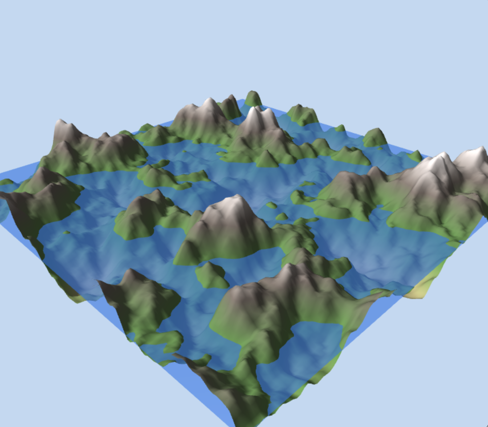{ width=50% }

Die Analyse verdeutlicht, dass moderne Grafikhardware die parallele Berechnung großer Datenmengen effizient unterstützt. Insbesondere Compute Shader ermöglichen die schnelle Berechnung komplexer Noise-Funktionen, während die übrigen Shader-Stufen die resultierenden Daten direkt innerhalb der Rendering-Pipeline weiterverarbeiten können.

Darüber hinaus wurde sichtbar, dass die Wahl des verwendeten Noise-Verfahrens einen erheblichen Einfluss auf das Erscheinungsbild des Terrains besitzt. Während einfache Verfahren bereits natürliche Strukturen erzeugen können, liefern komplexere Ansätze wie Perlin- oder Simplex-Noise realistischere und weniger repetitive Landschaften.

## Kritische Einordnung {#fazit2}

Trotz der Vorteile existieren auch Einschränkungen. Prozedural erzeugte Landschaften wirken häufig künstlich, wenn ausschließlich mathematische Noise-Funktionen verwendet werden. Natürliche Prozesse wie Erosion, Sedimentablagerung oder Vegetationswachstum werden dabei nicht berücksichtigt.

Zudem besteht ein grundlegender Zielkonflikt zwischen:

- Realismus
- Berechnungsaufwand
- Speicherverbrauch
- Generierungsgeschwindigkeit

Je höher der gewünschte Detailgrad, desto komplexer werden die verwendeten Algorithmen und Shaderprogramme. Besonders bei Echtzeit-Anwendungen müssen daher Kompromisse zwischen visueller Qualität und Performance getroffen werden.

# Ausblick {#ausblick}

## Level of Detail (LOD) {#ausblick1}

Ein weiteres zentrales Forschungsfeld stellen sogenannte Level-of-Detail-Verfahren (LOD) dar. Hierbei wird die geometrische Komplexität eines Terrains abhängig von der Entfernung zur Kamera angepasst.

- Nahe Bereiche werden mit hoher Polygonanzahl dargestellt.
- Entfernte Bereiche verwenden vereinfachte Geometrie.
- Die verfügbare Rechenleistung kann gezielt auf sichtbare Details konzentriert werden.

In Kombination mit Tessellation Shadern ermöglicht dieser Ansatz eine hohe visuelle Qualität bei gleichzeitig guter Performance.

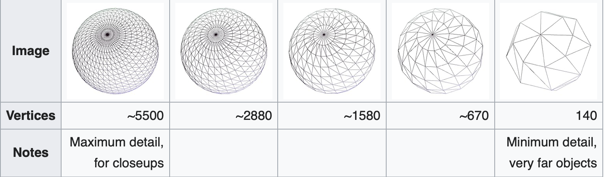{ width=70% }


## Simulation natürlicher Prozesse: Wasser- und Erosionssimulation {#ausblick2}

Während prozedurale Verfahren wie Perlin- oder Simplex-Noise eine statische Landschaftsform erzeugen, wirken natürliche Umgebungen in der Realität stark durch physikalische Prozesse verändert. Besonders Wasser spielt dabei eine zentrale Rolle, da es sowohl Landschaften formt als auch kontinuierlich verändert.

Ein wichtiger Erweiterungsschritt ist die Simulation von Wasserfluss über das Terrain. Dabei wird das  Heightmap nicht mehr als statisch betrachtet, sondern als dynamische Oberfläche, über die Wasserpartikel fließen.

Typische vereinfachte Modelle arbeiten dabei mit diskreten Zellen (Grid-basiert):

- Jede Zelle besitzt:
  - Höhe des Terrains
  - Wassermenge
  - Sedimentmenge

Der Simulationsschritt kann vereinfacht so beschrieben werden:

1. **Wasserflussberechnung**
   Wasser fließt von höheren zu niedrigeren Nachbarzellen abhängig vom Höhenunterschied.

2. **Erosion**
   Fließendes Wasser löst Material aus dem Terrain:
   - steile Bereiche → starke Erosion
   - flache Bereiche → geringe Erosion

3. **Sedimenttransport**
   Das gelöste Material wird mit dem Wasser transportiert.

4. **Ablagerung (Deposition)**
   Wenn die Fließgeschwindigkeit sinkt, wird Sediment wieder abgelagert.

Im Gegensatz zu reinem Noise wirkt das Terrain dadurch „physikalisch plausibel“, da typische geologische Muster nachgebildet werden.

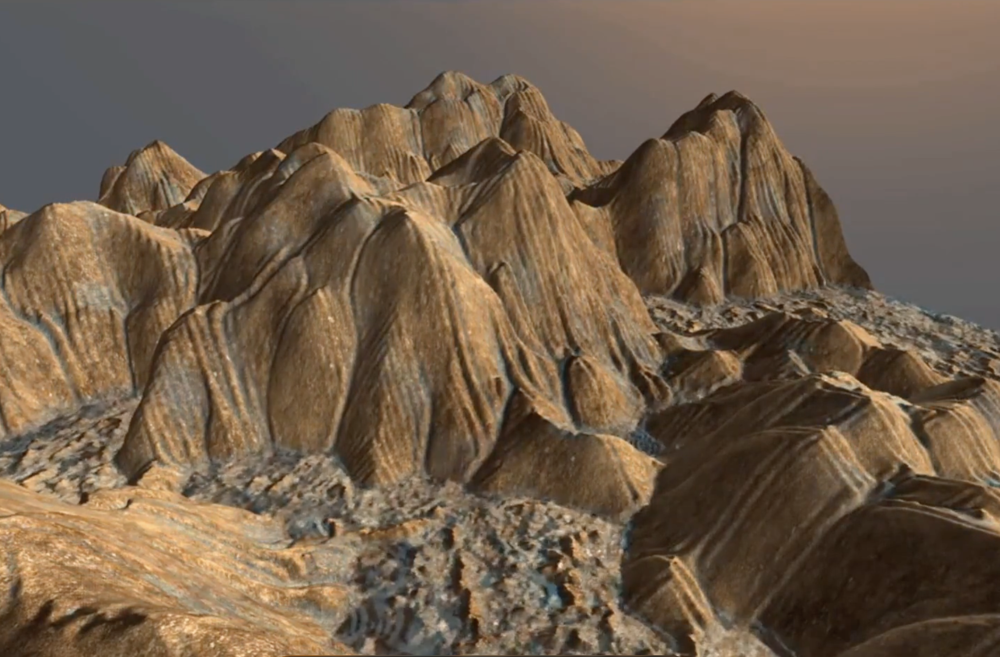{ width=50% }


---

## Machine Learning und hybride Ansätze {#ausblick3}

### Automatische Biome-Generierung aus Heightmaps

Ein  konkreter Anwendungsfall für Machine Learning in der prozeduralen Generierung ist die **automatische Ableitung von Biomen aus bestehenden Heightmaps**.

Während klassische Verfahren Biome meist regelbasiert erzeugen, nutzen ML-Modelle einen datengetriebenen Ansatz, um komplexere und realistischere Verteilungen zu erzeugen.

---

### ML-basierter Ansatz

Ein neuronales Netzwerk  wird auf realen geografischen Daten trainiert. Diese Daten enthalten:

- Höheninformationen (Digital Elevation Models)
- Klimadaten (Temperatur, Niederschlag)
- Landbedeckung (Vegetation, Wasser, Gestein)

Das Modell lernt dabei eine Abbildung:

> Heightmap + Kontextdaten → Biome-Klassifikation pro Pixel / Region

---

### Ergebnis: Kontinuierliche Biome-Maps

Anstatt diskreter Zonen entstehen **weiche, kontinuierliche Übergänge** zwischen Biomen.

### Integration in die GPU-Pipeline

Der ML-Schritt wird typischerweise **nach der Terrain-Generierung, aber vor der finalen Texturierung** eingesetzt:

1. Compute Shader erzeugt Heightmap (Noise)
2. CNN berechnet Biome-Map
3. Fragment Shader nutzt Biome-Map für Textur-Mixing
4. Finales Rendering kombiniert Höhe + Biome + Licht

---

### Vorteil gegenüber klassischen Methoden

Im Vergleich zu regelbasierten Systemen bietet dieser Ansatz:

- höhere visuelle Vielfalt
- realistischere Übergänge zwischen Landschaftstypen
- bessere Anpassung an komplexe Topologien
- datenbasierte „natürliche“ Verteilungsmuster


# Referenzen {#referenzen}

1. [Chunk format, Minecraft Wiki](https://minecraft.fandom.com/wiki/Chunk_format)

2. [How Big Can a Minecraft World Be, Burn](https://cybrancee.com/blog/how-big-can-a-minecraft-world-be/)

3. [An Image Synthesizer, Ken Perlin](https://dl.acm.org/doi/10.1145/325334.325247)

4. [The Algorithmic Beauty of Plants, Przemyslaw Prusinkiewicz](https://scispace.com/pdf/the-algorithmic-beauty-of-plants-4f9yunhil9.pdf)

5. [Procedural Generation with Wave Function Collapse, Vectorized](https://vectrx.substack.com/p/wave-function-collapse)

6. [terrain erosion 3 ways, dandrino](https://github.com/dandrino/terrain-erosion-3-ways)

7. [Procedural Terrain Generation Using Generative Adversarial Networks, Voulgaris et al.](https://ieeexplore.ieee.org/document/9616151)

8. [Rendering Pipeline Overview, OpenGL](https://wikis.khronos.org/opengl/Rendering_Pipeline_Overview)

9. [Compute Shader, OpenGL](https://wikis.khronos.org/opengl/Compute_Shader)

10. [Compute Shader Overview, Microsoft](https://learn.microsoft.com/en-us/windows/win32/direct3d11/direct3d-11-advanced-stages-compute-shader)

11. [CUDA programming guide, Nvidia](https://docs.nvidia.com/cuda/cuda-programming-guide/01-introduction/introduction.html)

12. [Efficient Simulation of Volumetric Deformable Objects in Unity3D: GPU-Accelerated Position-Based Dynamics, Va et al.](https://doi.org/10.3390/electronics12102229?urlappend=%3Futm_source%3Dresearchgate.net%26utm_medium%3Darticle)

13. [Compute Shader, Vulkan](https://docs.vulkan.org/tutorial/latest/11_Compute_Shader.html)

14. [Matrix Multiplication Background User's Guide, NVIDIA Deep Learning Performance](https://docs.nvidia.com/deeplearning/performance/dl-performance-matrix-multiplication/index.html)

15. [WebGPU Meets Zero-Knowledge: Can Browser-Based Proving Finally Work, WebGL / WebGPU](https://www.webgpu.com/news/zk-proofs-webgpu-boost/)

16. [The Book of Shaders, Patricio Gonzalez Vivo und Jen Lowe, Kapitel 11](https://thebookofshaders.com/11/)

17. [An image of digitally-generated white noise, Jorge Stolfi](https://en.wikipedia.org/wiki/White_noise#/media/File:White-noise-mv255-240x180.png)

18. [World generation, Minecraft Wiki](https://minecraft.wiki/w/World_generation)

19. [Value Noise and Procedural Patterns, Scratchapixel](https://www.scratchapixel.com/lessons/procedural-generation-virtual-worlds/procedural-patterns-noise-part-1/creating-simple-1D-noise.html)

20. [Sharing everything I could understand about gradient noise, bµg](https://blog.pkh.me/p/42-sharing-everything-i-could-understand-about-gradient-noise.html)

21. [Improving noise, Ken Perlin](https://doi.org/10.1145/566654.566636)

22. [Perlin Noise, Scratchapixel](https://www.scratchapixel.com/lessons/procedural-generation-virtual-worlds/perlin-noise-part-2/perlin-noise.html)

23. [Improved Perlin Noise, Scratchapixel](https://www.scratchapixel.com/lessons/procedural-generation-virtual-worlds/perlin-noise-part-2/improved-perlin-noise.html)

24. [Noise generator, Minecraft Fandom Wiki](https://minecraft.fandom.com/wiki/Noise_generator)

25. [The Book of Shaders, Patricio Gonzalez Vivo und Jen Lowe, Kapitel 13](https://thebookofshaders.com/13/)

26. [Brownian Noise, Michael Macha](https://michaelmacha.wordpress.com/2022/05/09/brownian-noise/)

27. [Vorlesungsunterlagen zur Vertex-Verarbeitung](unterlagen/vc_syn_sp_raster_vertex_proc.pdf)

28. [Bilineare Texturfilterung, Microsoft](https://learn.microsoft.com/de-de/windows/uwp/graphics-concepts/bilinear-texture-filtering)

29. [Bilineare Filterung, Wikipedia](https://de.wikipedia.org/wiki/Bilineare_Filterung)

30. [Heightmap, Wikipedia](https://en.wikipedia.org/wiki/Heightmap)

31. [Displacement mapping, Wikipedia](https://en.wikipedia.org/wiki/Displacement_mapping)

32. [Marching cubes, Wikipedia](https://en.wikipedia.org/wiki/Marching_cubes)

33. [Dual contouring, Boris the Brave](https://www.boristhebrave.com/2018/04/15/dual-contouring-tutorial/)

34. [Voxel, Wikipedia](https://en.wikipedia.org/wiki/Voxel)

35. [Vorlesungsunterlagen zur Fragment-Verarbeitung](unterlagen/vc_syn_sp_raster_frac_proc.pdf)

36. [Mastering Tessellation Shaders](https://nedmakesgames.medium.com/mastering-tessellation-shaders-and-their-many-uses-in-unity-9caeb760150e)

37. [Tessellation Chapter II: Rendering Terrain using Tessellation Shaders](https://learnopengl.com/Guest-Articles/2021/Tessellation/Tessellation)

38. [Implementing Time Intervals in GLSL](https://medium.com/hello-quaternions/implementing-time-intervals-in-gl-doing-things-cyclicly-part-2-22792f8009a8)

39. [Fragment Shader, Khronos OpenGL Wiki](https://wikis.khronos.org/opengl/Fragment_Shader)

40. [Level of detail, Wikipedia](https://en.wikipedia.org/wiki/Level_of_detail_(computer_graphics))

41. [Interactive Hydraulic Erosion Simulator](https://huw-man.github.io/Interactive-Erosion-Simulator-on-GPU/)

42. [Deep convolutional generative adversarial network for procedural 3D landscape generation based on DEM](https://link.springer.com/chapter/10.1007/978-3-319-76908-0_9)
